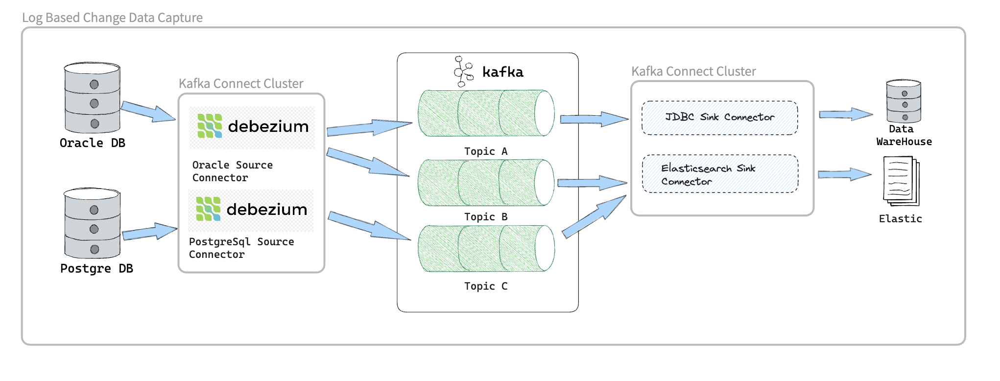
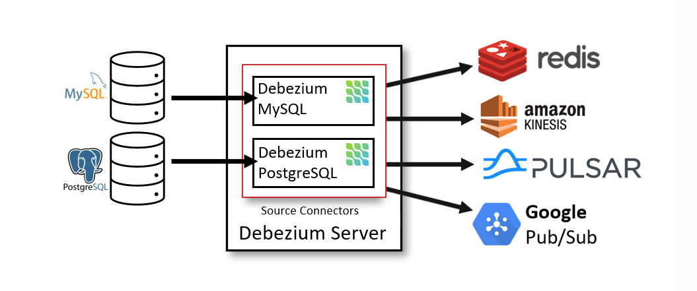
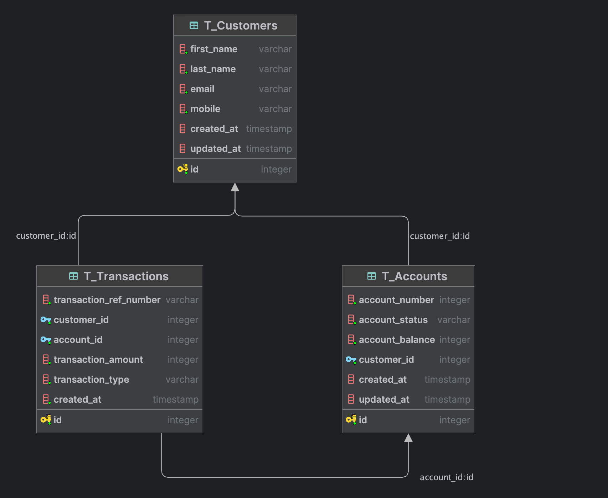
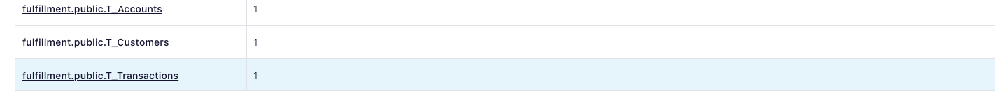
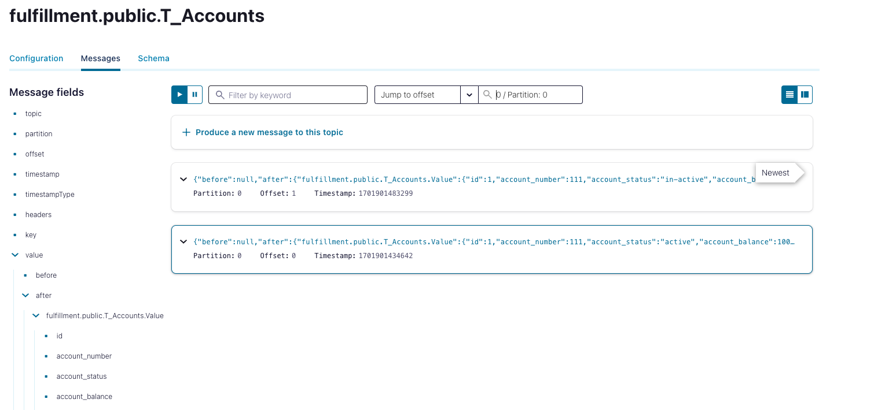

= Change Data Capture With Debezium
Motaz Mohammed Sameh <motazco135@gmail.com>
3.0, August 18, 2023: AsciiDoc article template
:toc:
:icons: font
:url-quickref: https://docs.asciidoctor.org/asciidoc/latest/syntax-quick-reference/

== Why Change Data Capture?
We have a transaction log at our database systems which have all change events occurred in the Database systems will be appended in the transaction log (For each Inserter/UPDATE transaction/Delete).

This transaction logs table are used at replication of data between our database instances.

We have systems that require to have the data fresh and updated one the events occurred to process teh  data  and show instance updates.

== Debezium
Debezium Capture the changes from transaction log and propagate as events to any kind of downstream consumers.

This allows us to take the data from our operational database over to other systems that would like to have the data and process the data.

Debezium allow us to take the data as quickly as possible.

.Debezium-Log-based Change Data Capture

As shown in Figure 1 above we have the source systems database and Debezium use Database connectors based on the Database type so there is a connector for each database type,

We can push events the debezium capture from the source operational database directory to the downstream systems like Elasticsearch or to Data-warehouse .

However, we cloud add apache kafka in between this will enable to increase the  optionality that we can have, we can set up multiple consumers that will enable us to get teh  change events distributed to multiple systems at near realtime, so have the sink connector that take the data from kafka and push this changes to  downstream system directly.

.Debezium is a CDC platform
** Based on the Transaction log.
** Snapshotting, filtering
** Outbox support
** web-based ui
** Fully open-source, very active community
** Large production deployments

=== Debezium Connectors

Debezium’s goal is to build up a library of connectors that capture changes from a variety of database management systems and produce events with very similar structures, making it far easier for your applications to consume and respond to the events regardless of where the changes originated.

.Debezium Connectors:
** MongoDB
** MySQL
** PostgreSQL
** SQL Server
** Oracle
** Db2
** Cassandra
** Vitess *(Incubating)*
** Spanner *(Incubating)*
** JDBC *(Incubating)*

====
An incubating connector is one that has been released for preview purposes and is subject to changes that may not always be backward compatible.
====

=== Debezium Architecture

.Apache kafka Connect
Most commonly debezium deployed by means of Apache kafka Connect, Kafka connect is a framework and runtime for implementing and operating :
** Source connectors such as Debezium that send records into kafka.
** Sink connectors that propagate records from kafka topics to other systems.

The following image shows the architecture of a change data capture pipline based on debezium:

.Debezium-Log-based Change Data Capture

As shown in the image, the debezium connectors for Oracle anf PostgresSql are deployed to capture changes to theses two types of databases. Each Debezium connector establishes a connection to its source database.

Kafka Connect operates as a separate service beside the kafka broker.

By default, changes from one database table are written to a Kafka topic whose name corresponds to the table name.

After change event records are in Apache Kafka, different connectors in the Kafka Connect eco-system can stream the records to other systems and databases such as Elasticsearch, data warehouses and analytics systems.

.Debezium Server
Another way to deploy Debezium is using the Debezium Server. The Debezium Server is a configurable, ready-to-use application that streams events from source database to a variety of messaging infrastructures.

The following image shows the architecture of a change data capture pipeline that uses the Debezium server:

.Debezium Server

The Debezium server is configured to use one of the Debezium source connectors to capture changes from the source database. Change events can be serialized to different formats like JSON or Apache Avro and then will be sent to one of a variety of messaging infrastructures such as Amazon Kinesis, Google Cloud Pub/Sub, or Apache Pulsar.

.Embedded Engine
Yet an alternative way for using the Debezium connectors is the embedded engine.

In this case, Debezium will not be run via Kafka Connect, but as a library embedded into your custom Java applications. This can be useful for either consuming change events within your application itself, without the needed for deploying complete Kafka and Kafka Connect clusters, or for streaming changes to alternative messaging brokers such as Amazon Kinesis.

== Use Case

Let's start developing some real world UseCase scenario to evaluate our CDC approach,

Our use case will focus on updating customer bank account information and bank account balance,
we need to notify other systems regarding the customer account balance once the customer do any transaction. +
This will help in monitoring customer transaction behaviour in order to protect our customer against fraudulent by notifying the fraud monitoring system about the transaction. +

We will assume that we have the following DB tables :

* T_Customers : +
This Table will contain our customer information.
|===
|Column Name | Description

|ID
|Unique identifier

|first_name
|Customer First Name

|last_name
|Customer Last Name

|email
|Customer Email address

|mobile
|Customer Mobile number

|created_at
|Date of Creation

|updated_at
|Date of update
|===

* T_Accounts : +
This will contain our customer accounts.

|===
|Column Name | Description

|ID
|Unique identifier

|Account_Number
|Account Number

|Account_Status
|Indicator about account status (Active,Inactive)

|Account_Balance
|Available Balance

|Customer_ID
|Customer ID, to link account with Customer

|created_at
|Date of Creation

|updated_at
|Date of update
|===

* T_Transactions: +
This table will contain customer financial transaction.
|===
|Column Name | Description

| ID
| Unique identifier

|transaction_ref_number
|Unique Transaction Reference Number

|Customer_ID
|Customer ID

|Account_ID
|Customer Account ID

|Transaction_Amount
|Transaction Amount

|Transaction_Type
|Transaction Type is Crediting or Debiting customer Account

|Created_AT
|Date of creation of record in DB
|===

=== SetUP
we will use docker compose to SetUp our environment which will contains : +

* confluent kafka
* confluent kafka-connect
* confluent control-center
* Postgres DataBase

[source,yaml]
----
version: '2'
services:

  broker:
    image: confluentinc/cp-kafka:7.4.0
    hostname: broker
    container_name: broker
    ports:
      - "9092:9092"
      - "9101:9101"
    environment:
      KAFKA_NODE_ID: 1
      KAFKA_LISTENER_SECURITY_PROTOCOL_MAP: 'CONTROLLER:PLAINTEXT,PLAINTEXT:PLAINTEXT,PLAINTEXT_HOST:PLAINTEXT'
      KAFKA_ADVERTISED_LISTENERS: 'PLAINTEXT://broker:29092,PLAINTEXT_HOST://localhost:9092'
      KAFKA_OFFSETS_TOPIC_REPLICATION_FACTOR: 1
      KAFKA_GROUP_INITIAL_REBALANCE_DELAY_MS: 0
      KAFKA_TRANSACTION_STATE_LOG_MIN_ISR: 1
      KAFKA_TRANSACTION_STATE_LOG_REPLICATION_FACTOR: 1
      KAFKA_JMX_PORT: 9101
      KAFKA_JMX_HOSTNAME: localhost
      KAFKA_PROCESS_ROLES: 'broker,controller'
      KAFKA_CONTROLLER_QUORUM_VOTERS: '1@broker:29093'
      KAFKA_LISTENERS: 'PLAINTEXT://broker:29092,CONTROLLER://broker:29093,PLAINTEXT_HOST://0.0.0.0:9092'
      KAFKA_INTER_BROKER_LISTENER_NAME: 'PLAINTEXT'
      KAFKA_CONTROLLER_LISTENER_NAMES: 'CONTROLLER'
      KAFKA_LOG_DIRS: '/tmp/kraft-combined-logs'
      # Replace CLUSTER_ID with a unique base64 UUID using "bin/kafka-storage.sh random-uuid"
      # See https://docs.confluent.io/kafka/operations-tools/kafka-tools.html#kafka-storage-sh
      CLUSTER_ID: 'MkU3OEVBNTcwNTJENDM2Qk'

  schema-registry:
    image: confluentinc/cp-schema-registry:7.4.0
    hostname: schema-registry
    container_name: schema-registry
    depends_on:
      - broker
    ports:
      - "8081:8081"
    environment:
      SCHEMA_REGISTRY_HOST_NAME: schema-registry
      SCHEMA_REGISTRY_KAFKASTORE_BOOTSTRAP_SERVERS: 'broker:29092'
      SCHEMA_REGISTRY_LISTENERS: http://0.0.0.0:8081

  kafka-connect:
    image: confluentinc/cp-kafka-connect-base:latest
    container_name: kafka-connect
    depends_on:
      - broker
      - schema-registry
      - db
    ports:
      - 8083:8083
    links:
      - "db:database"
    environment:
      CONNECT_BOOTSTRAP_SERVERS: "broker:29092"
      CONNECT_REST_PORT: 8083
      CONNECT_GROUP_ID: kafka-connect
      CONNECT_CONFIG_STORAGE_TOPIC: _connect-configs
      CONNECT_OFFSET_STORAGE_TOPIC: _connect-offsets
      CONNECT_STATUS_STORAGE_TOPIC: _connect-status
      CONNECT_KEY_CONVERTER: org.apache.kafka.connect.storage.StringConverter
      CONNECT_VALUE_CONVERTER: io.confluent.connect.avro.AvroConverter
      CONNECT_VALUE_CONVERTER_SCHEMA_REGISTRY_URL: 'http://schema-registry:8081'
      CONNECT_REST_ADVERTISED_HOST_NAME: "kafka-connect"
      CONNECT_LOG4J_APPENDER_STDOUT_LAYOUT_CONVERSIONPATTERN: "[%d] %p %X{connector.context}%m (%c:%L)%n"
      CONNECT_CONFIG_STORAGE_REPLICATION_FACTOR: "1"
      CONNECT_OFFSET_STORAGE_REPLICATION_FACTOR: "1"
      CONNECT_STATUS_STORAGE_REPLICATION_FACTOR: "1"
    #  ---------------
      CONNECT_PLUGIN_PATH: /usr/share/java,/usr/share/confluent-hub-components,/data/connect-jars
    # If you want to use the Confluent Hub installer to d/l component, but make them available
    # when running this offline, spin up the stack once and then run :
    #   docker cp kafka-connect:/usr/share/confluent-hub-components ./data/connect-jars
    volumes:
      - $PWD/data:/data
    # In the command section, $ are replaced with $$ to avoid the error 'Invalid interpolation format for "command" option'
    command:
      - bash
      - -c
      - |
        echo "Installing Connector"
        confluent-hub install --no-prompt confluentinc/kafka-connect-jdbc:10.7.2
        confluent-hub install --no-prompt debezium/debezium-connector-postgresql:2.2.1
        #
        echo "Launching Kafka Connect worker"
        /etc/confluent/docker/run &
        #
        sleep infinity

  control-center:
    image: confluentinc/cp-enterprise-control-center:7.4.0
    hostname: control-center
    container_name: control-center
    depends_on:
      - broker
      - schema-registry
      - kafka-connect
    ports:
      - "9021:9021"
    environment:
      CONTROL_CENTER_CONNECT_HEALTHCHECK_ENDPOINT: '/connectors'
      CONTROL_CENTER_BOOTSTRAP_SERVERS: 'broker:29092'
      CONTROL_CENTER_CONNECT_CONNECT_CLUSTER: 'kafka-connect:8083'
      CONTROL_CENTER_SCHEMA_REGISTRY_URL: "http://schema-registry:8081"
      CONTROL_CENTER_REPLICATION_FACTOR: 1
      CONTROL_CENTER_INTERNAL_TOPICS_PARTITIONS: 1
      CONTROL_CENTER_MONITORING_INTERCEPTOR_TOPIC_PARTITIONS: 1
      CONFLUENT_METRICS_TOPIC_REPLICATION: 1
      PORT: 9021
    command:
      - bash
      - -c
      - |
        echo "Waiting two minutes for Kafka brokers to start and
               necessary topics to be available"
        sleep 120
        /etc/confluent/docker/run

  rest-proxy:
    image: confluentinc/cp-kafka-rest:7.4.0
    depends_on:
      - broker
      - schema-registry
    ports:
      - 8082:8082
    hostname: rest-proxy
    container_name: rest-proxy
    environment:
      KAFKA_REST_HOST_NAME: rest-proxy
      KAFKA_REST_BOOTSTRAP_SERVERS: 'broker:29092'
      KAFKA_REST_LISTENERS: "http://0.0.0.0:8082"
      KAFKA_REST_SCHEMA_REGISTRY_URL: 'http://schema-registry:8081'

  db:
    image: postgres
    ports:
      - 5432:5432
    expose:
      - 5432
    environment:
      POSTGRES_PASSWORD: postgres

----

To run Docker compose use the following :
[source,shell]
----
docker compose up
----

once docker containers finished , you can validate the setup of kafka by hitting the url of Control Center
http://http://localhost:9021/[]

DB setup validation you can connect to DB  using the following connection parameter from host machine : +
[source,]
----
* Username : postgres
* Password : postgres
* Port : 5432
----

=== Create Database Tables

[IMPORTANT]
.Postgres Server Settings
====
. Verify that the *#https://www.postgresql.org/docs/current/runtime-config-wal.html[wal_level]#* parameter is set to *#logical#* by running the query *#SHOW wal_level#* as the database RDS master user.
. Configure user  https://debezium.io/documentation/reference/connectors/postgresql.html#postgresql-permissions[permissions.]
====

Use the following script to create Tables :
[source,sql]
----
create table public."T_Customers"
(
    ID         serial  not null
        constraint "T_Customers_pk"
            primary key,
    first_name varchar not null,
    last_name  varchar not null,
    email      varchar not null,
    mobile     varchar not null,
    created_at timestamp default CURRENT_TIMESTAMP,
    updated_at timestamp default CURRENT_TIMESTAMP
);

create table public."T_Accounts"
(
    ID                serial  not null
        constraint "T_Accounts_pk"
            primary key,
    account_number  integer not null,
    account_status  varchar not null,
    account_balance integer not null,
    customer_id     integer not null
        constraint "T_Accounts_T_Customers_id_fk"
            references public."T_Customers",
    created_at        timestamp default CURRENT_TIMESTAMP,
    updated_at        timestamp default CURRENT_TIMESTAMP
);

create table public."T_Transactions"
(
    id                     serial                             not null
        constraint "T_Transactions_pk"
            primary key,
    transaction_ref_number varchar                             not null,
    customer_id            integer                             not null
        constraint "T_Transactions_T_Customers_id_fk"
            references public."T_Customers",
    account_id             integer                             not null
        constraint "T_Transactions_T_Accounts_id_fk"
            references public."T_Accounts",
    transaction_amount     integer                             not null,
    transaction_type       varchar                             not null,
    created_at             timestamp default CURRENT_TIMESTAMP not null
);
----

.ERD Diagram

=== Debezium Kafka Connector Configuration

Following is the configuration for a PostgreSQL connector that connects to a PostgreSQL server on port 5432 at Host: db which is to name of the container in the docker compose, whose logical name is fulfillment.  +

We can choose to produce events for a subset of the schemas and tables in a database. Optionally, we can ignore, mask, or truncate columns that contain sensitive data, are larger than a specified size, or that we do not need.

[source,json]
----
{
  "name": "fulfillment-connector",
  "config": {
    "name": "fulfillment-connector",
    "connector.class": "io.debezium.connector.postgresql.PostgresConnector",
    "tasks.max": "1",
    "topic.prefix": "fulfillment",
    "database.hostname": "db",
    "database.port": "5432",
    "database.user": "postgres",
    "database.password": "********",
    "database.dbname": "Test",
    "plugin.name": "pgoutput",
    "slot.name": "debezium_01"
  }
}
----

=== Check Created Kafka Topic
Now we will start Insert and update some records in the DB and check the Kafka topic.

Run the following database insert statement :
[source,sql]
----
INTO public."T_Customers" (id, first_name, last_name, email, mobile, created_at, updated_at) VALUES (DEFAULT, 'motaz'::varchar, 'motaz'::varchar, 'motaz@test.com'::varchar, '0555555555'::varchar, DEFAULT, DEFAULT)

INSERT INTO public."T_Accounts" (id, account_number, account_status, account_balance, customer_id, created_at, updated_at) VALUES (DEFAULT, 111::integer, 'active'::varchar, 1000::integer, 1::integer, DEFAULT, DEFAULT);

UPDATE public."T_Accounts" SET account_status = 'in-active'::varchar WHERE id = 1::integer;

INSERT INTO public."T_Transactions" (id, transaction_ref_number, customer_id, account_id, transaction_amount, transaction_type, created_at) VALUES (DEFAULT, 'ref-01'::varchar, 1::integer, 1::integer, 10::integer, 'Credit'::varchar, DEFAULT);

----

Now after running the query we should go and check the kafka control center, in order to check the created kafka topics. +
We should found the following kafka topics created :

.Kafka Control Center

We will found that we have a three created topics each one represents a table that we had run a query on it and topic name starts with the prefix that we have defined.

We can check the published messages in the kafka topic for validation.

. Click on topic from control center Example : ##fulfillment.public.T_Accounts ##
. Click on messages.
. Select offset 0 at jump to offset.
. We will see the following message :

.Kafka Topic message-viewer

we will see two messages first message is related to the insert statement and the second message related to the update statement.

You will notice that the message contains json object as following :
[source,json]
----
[
    {
        "topic": "fulfillment.public.T_Accounts",
        "partition": 0,
        "offset": 0,
        "timestamp": 1701901434642,
        "timestampType": "CREATE_TIME",
        "headers": [],
        "key": "Struct{id=1}",
        "value": {
            "before": null,
            "after": {
                "fulfillment.public.T_Accounts.Value": {
                    "id": 1,
                    "account_number": 111,
                    "account_status": "active",
                    "account_balance": 1000,
                    "customer_id": 1,
                    "created_at": {
                        "long": 1701901434200964
                    },
                    "updated_at": {
                        "long": 1701901434200964
                    }
                }
            },
            "source": {
                "version": "2.2.1.Final",
                "connector": "postgresql",
                "name": "fulfillment",
                "ts_ms": 1701901434224,
                "snapshot": {
                    "string": "false"
                },
                "db": "Test",
                "sequence": {
                    "string": "[\"31538088\",\"31538304\"]"
                },
                "schema": "public",
                "table": "T_Accounts",
                "txId": {
                    "long": 774
                },
                "lsn": {
                    "long": 31538304
                },
                "xmin": null
            },
            "op": "c",
            "ts_ms": {
                "long": 1701901434351
            },
            "transaction": null
        },
        "__confluent_index": 0
    }
]
----

== Conclusion

The fraud tool will be able to use the data from the Kafka topic to begin creating the customer profile because we have now established a CDC data flow and are able to publish the data in almost real-time.

Next, we'll look at how the established CDC can be used to build the Operational Data Store layer.

https://motazco135.github.io/blog/[<-Back]