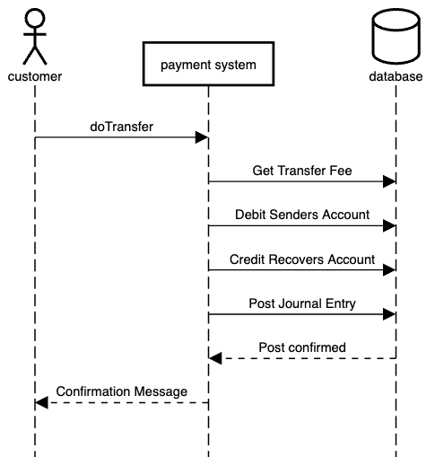
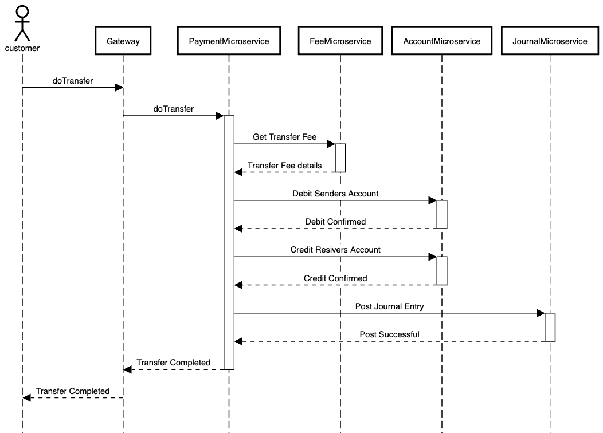
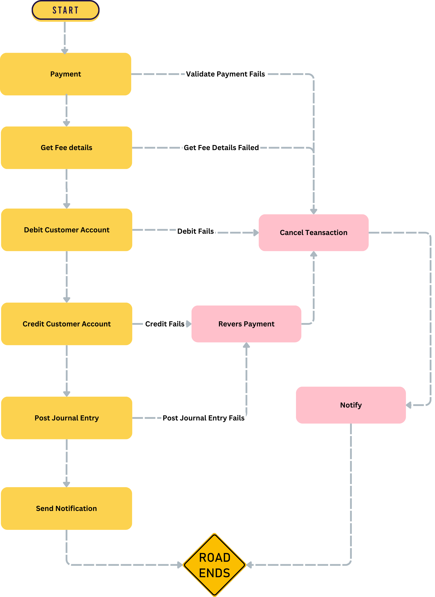
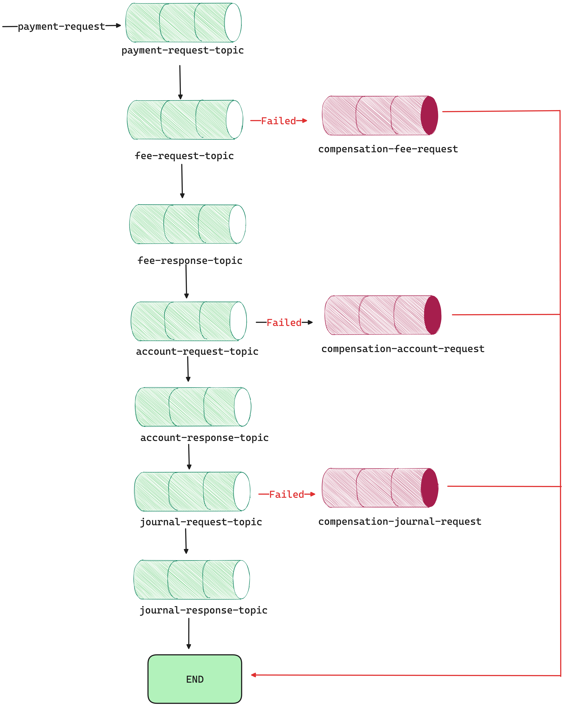

= Distributed Transaction
Motaz Mohammad <motazco135@gmail.com>
3.0, July 11, 2024: AsciiDoc article template
:toc:
:icons: font
:url-quickref: https://docs.asciidoctor.org/asciidoc/latest/syntax-quick-reference/

One of the common issues is how to manage the Distributed Transaction across multiple microservices, There is a lot of patterns to manage distributed transaction, In this article I will try to share one of the common patters and will try to share a sample code base.

== What is Distributed Transaction?

When microservice architecture decomposes a monolithic systems into self-encapsulated service, this breaks the transaction, Which mean that a local transaction in the monolithic system is now distributed into multiple service.

A distributed transaction is a very complex process with a lot of moving parts that can fail, which could seriously effects the user experience and overall system, *So the best way to solve distributed transactions problem is to avoid them*

Here is a Bank Payment Transfer transaction example with a monolithic system which using local transaction:

In Bank Payment transaction example above, if the customer sends a *"Transfer"* action to the Payment Systems, Payment System Validate the Payment and get transfer fee, debit the customer account with amount ,
credit the receiver account with the amount and Post transaction details and now transfer request will be confirmed.

So in monolithic systems if any step of the transaction flow failed, The transaction can *roll back*. This is knows as *ACID* (Atomicity, Consistency, Isolation, Durability), which is guaranteed by the database system.

When we decompose this system into multiple microservice, We created  `PaymentMiacroservice` ,`FeeMiacroservice` , `AccountMicroservice` and `JournalMicroservice` which have separated databases, now hte customer transfer action will be as following :

When customer sends a *"Do Transfer"* action, `PaymentMiacroservice`
`FeeMiacroservice` , `AccountMicroservice` and `JournalMicroservice` will be called to apply the change into their own database.
Because the transaction is now across multiple databases, it is now considered a `Distribted truansaction`.

=== What is the problem ?
In monolithic application, We have a database to ensure *ACIDity*.
but with distributed systems now we need to clarify *How do we keep the transaction atomic?*
The business transaction can span across multiple service which are composed of multiple local transaction within individual services.

== Possible Solutions
One of the Solutions to implement Distributed transactions is :

* SAGA Design Pattern

== SAGA Design Pattern
Saga is a sequence of local transactions.Each local transaction updates the database and publishes an event to trigger the next local transaction in the saga, each local transaction has a corresponding compensating transaction in order to roll back.

If a local transaction fails, the saga executes a series of compensating transactions to roll back the changes made by the previous transactions.This ensures that the system remains consistent event when transactions fail.

In Saga pattern, a compensating transaction must be idempotent and retryable.

In our example above the transfer action consists of sequential steps as following :

=== Two ways of implementing Saga Pattern
The Saga Pattern can be implemented in two different ways :

* *Choreography* - each local transaction publishes events that trigger local transaction in other service, there is no centralized coordinator , making communication between services more difficult.
+

** Choreography based SAGA can further be implemented in two ways based on how events are being used:
*** Choreography using Outbox Store (Outbox Pattern)
*** Choreography using Event Sourcing(Event Sourcing Pattern)

* *Orchestration* - All microservice are linked to the centralized coordinator that orchestrates the services in a predefined order to complete or roll back a business transaction.
+

=== Why Orchestration Saga Pattern
The decentralized approach in the choreography pattern make it more challenging to manage and monitor the service interaction.The Complexity increase with a lack of centralized coordination and visibility which making the application harder to maintain.

== Implementing Saga Orchestration
Now, let’s look at a practical example of an application employing the Saga Pattern with using https://camel.apache.org/components/4.4.x/eips/saga-eip.html[Apache Camel] and https://kafka.apache.org/[Kafka] .

. *Payment Service* : The Payment service receives a request to create a new transfer request, including transfer details such as
Sender account number, Receiver account number, transfer amount and the transfer notes.
. *Fee service* : The Payment service communicates with the fee service to get the transfer fees based on  transfer amount, and then the transfer request can proceed.
. *Account Service* : Once transfer request is confirmed, the payment service will contact the account service to Debit the sender account and credit the receiver account, This step ensures the sender has sufficient funds before credit the receiver account.
. *Journal Service* : If the Account Service completed successfully , the Journal Service will be called to write the journal entries in the database and update the transfer status.

The logic will be distributed among :

* Payment Microservice
* Fee Microservice
* Account Microservice
* Journal Microservice

TIP: We will also implement to https://www.baeldung.com/cs/outbox-pattern-microservices[Outbox] and https://softwaremill.com/microservices-101/[Inbox] pattern to make sure that the message is processed one time.

.We will create the following microservice:
* payment
* fee
* account
* journal

Let's start implementation :

.payment Microservice:
* Controller in the Payment Microservice to receive transfer request , performs basic validation, and saves the message to the outbox table.

* *TransferController.java*
+
[source,java]
----
@RestController
@RequiredArgsConstructor
@RequestMapping("/v1/transfer")
public class TransferController {

    private final TransferService transferService;

    @PostMapping
    public ResponseEntity<?> createTransferRequest(@RequestBody CreateTransferRequest createTransferRequest) throws JsonProcessingException {
        // Basic validation
        if(createTransferRequest.getTransferAmount()==0
        || createTransferRequest.getReceiverAccountNumber() == null
        || createTransferRequest.getSenderAccountNumber() == null)
        {
            return ResponseEntity.badRequest().body("Invalid request");
        }else{

            CreateTransferResponse transferResponse = transferService.createTransferRequest(createTransferRequest);
            return ResponseEntity.status(HttpStatus.CREATED)
                    .body(transferResponse);
        }
    }
}
----

* *TransferService.java*
+
In the TransferService we will create a method to receive the Transfer request and create and save Payment request in the OutBox entity with status "PENDING" where we will use a schedule job to read transfers requests with status PENDING and publish it to KAFKA topic "payment-request".
+
[source,java]
----
 @Transactional
    public CreateTransferResponse  createTransferRequest(CreateTransferRequest createTransferRequest) throws JsonProcessingException {

        // Create a unique payment ID
        UUID paymentId = UUID.randomUUID();
        TransferDto transferDto = TransferDto.builder()
                .paymentId(paymentId)
                .requestId(createTransferRequest.getRequestId())
                .transferAmount(createTransferRequest.getTransferAmount())
                .transferReason(createTransferRequest.getTransferReason())
                .senderAccountNumber(createTransferRequest.getSenderAccountNumber())
                .receiverAccountNumber(createTransferRequest.getReceiverAccountNumber())
                .state(TransferState.PENDING).build();

        // Save outbox message
        outboxService.saveMessage(paymentId,PAYMENT_REQUEST_TOPIC,mapper.writeValueAsString(transferDto));

        // Return response
        return CreateTransferResponse.builder()
                .paymentId(transferDto.getPaymentId())
                .state(transferDto.getState()).build();
    }

    @Transactional
    public void processTransferRequest(String paymentDetails ) throws JsonProcessingException {
        log.info("processTransferRequest payment details : {} ",paymentDetails);
        //convert json to object
        TransferDto transferDto = mapper.readValue(paymentDetails,TransferDto.class);

        //save Transfer in the DB
        TransferEntity transferEntity =  new TransferEntity();
        transferEntity.setPaymentId(transferDto.getPaymentId());
        transferEntity.setRequestId(transferDto.getRequestId());
        transferEntity.setReceiverAccountNumber(transferDto.getReceiverAccountNumber());
        transferEntity.setSenderAccountNumber(transferDto.getSenderAccountNumber());
        transferEntity.setTransferAmount(transferDto.getTransferAmount());
        transferEntity.setTransferReason(transferDto.getTransferReason());
        transferEntity.setState(TransferState.PROCESSING);
        transferRepository.save(transferEntity);
    }
----

Now we will create OutBox Pattern to be able to send the transfer request details:

* OutboxMessageEntity.java
+
[source,java]
----
@Data
@Entity
@Table(name="t_outbox_message")
public class OutboxMessageEntity {
    @Id
    @GeneratedValue(strategy = GenerationType.IDENTITY)
    private Long id;

    private String aggregateType;//denotes the kind of entity we’re dealing with

    @Column(nullable = false,columnDefinition = "VARCHAR(255)")
    private String payload;

    private UUID PaymentId;
    private String status;//message status

    @Column(updatable = false, name = "created_at" , columnDefinition = "TIMESTAMP")
    private LocalDateTime createdAt;

    @Column(name = "processed_at" , columnDefinition = "TIMESTAMP")
    private LocalDateTime processedAt;

    @PrePersist
    void setCreatedAt(){
        this.createdAt = LocalDateTime.now();
    }

    @PreUpdate
    void setProcessedAt(){
        this.processedAt = LocalDateTime.now();
    }
}
----

* OutboxRepository.java
+
[source , java]
----
public interface OutboxRepository extends JpaRepository<OutboxMessageEntity, Long> {
    @Query("SELECT o FROM OutboxMessageEntity o WHERE o.status = 'PENDING'")
    List<OutboxMessageEntity> findPendingMessages();
}
----
+
* OutboxService.java
+
Will do the following :
Save the transfer request in the Outbox table
and create schedule to check PENDING messages and Publish it to "payment-request" Kafka topic
+
[source,java]
----
@Slf4j
@Service
@RequiredArgsConstructor
public class OutboxService {

    private final CamelContext camelContext;
    private final OutboxRepository outboxRepository;

    @Transactional
    public void saveMessage(UUID paymentId, String aggregateType, String payload) {
        OutboxMessageEntity message = new OutboxMessageEntity();
        message.setPaymentId(paymentId);
        message.setAggregateType(aggregateType);
        message.setPayload(payload);
        message.setStatus(OutBoxStatus.PENDING.toString());
        outboxRepository.save(message);
    }

    @Scheduled(fixedRate = 5000)
    public void processOutboxMessages() {
        List<OutboxMessageEntity> messages = outboxRepository.findPendingMessages();
        for (OutboxMessageEntity message : messages) {
            log.info("send to kafka topic name: {} paymentId: {}",message.getAggregateType(),message.getPaymentId());
            camelContext.createProducerTemplate()
                    //.sendBodyAndHeader("kafka:" + message.getAggregateType()+"?key="+message.getPaymentId(),message.getPayload(), KafkaConstants.KEY,message.getPaymentId());
                    .sendBody("kafka:" + message.getAggregateType()+"?key="+message.getPaymentId(), message.getPayload());
            message.setStatus(OutBoxStatus.PROCESSED.toString());
            outboxRepository.save(message);
        }
    }
}
----
As you see above we use apache camel Context to send the transfer request to kafka :
camelContext.createProducerTemplate()
which use camel Uri to send data to the kafka topic.
to connect to Kafka in apache camel we add the following property:
+
.application.properties
----
camel.component.kafka.brokers=PLAINTEXT_HOST://localhost:9092

----

At This stage we have received Transfer request in the Payment microservice , perform basic validation and Store the transfer details in OutBoxMessage table to be processed and published to "payment-request" Kafka Topic.

Now we will write our Camel router class to start Saga process:

* TransferSagaRoute.java
+
[source,java]
----
@RequiredArgsConstructor
@Component
public class TransferSagaRoute extends RouteBuilder {

    private final TransferService transferService;
    private final InboxService inboxService;

    @Override
    public void configure() throws Exception {
        //here we will configure our saga process flow
        from("kafka:"+PAYMENT_REQUEST_TOPIC+"?groupId=payment-request-consumer-group" +
                "&autoOffsetReset=latest")
                .process(exchange -> {
                    String paymentId = exchange.getIn().getHeader("kafka.KEY", String.class);
                    String paymentDetails = exchange.getIn().getBody(String.class);
                    if (!inboxService.isProcessed(paymentId)) {
                        // Store payment request in the database
                        transferService.processTransferRequest(paymentDetails);
                        // Save the state to the database
                        inboxService.markAsProcessed(paymentId);
                        exchange.getIn().setBody(paymentDetails);
                        exchange.getIn().setHeader("paymentId", paymentId);
                    } else {
                        exchange.setProperty(Exchange.ROUTE_STOP, true);
                    }
                }).to("kafka:fee-request?brokers=#{{camel.component.kafka.brokers}}");
    }
}
----
+
* TransferEntity.java
+
[source,java]
----
@Data
@Entity
@Table(name="t_transfer")
public class TransferEntity {

    @Id
    private UUID paymentId;

    private UUID requestId;
    private String senderAccountNumber;
    private String receiverAccountNumber;
    private int transferAmount;
    private String transferReason;
    private int feeAmount;

    @Enumerated(EnumType.STRING)
    private TransferState state;

    @Column(updatable = false, name = "created_date" , columnDefinition = "TIMESTAMP")
    private LocalDateTime createdDate;

    @Column(name = "modified_date" , columnDefinition = "TIMESTAMP")
    private LocalDateTime modifiedDate;

    @PrePersist
    void setCreatedDate(){
        this.createdDate = LocalDateTime.now();
    }

    @PreUpdate
    void setModifiedDate(){
        this.modifiedDate = LocalDateTime.now();
    }
    public void fail() {
        this.state = TransferState.FAILED;
    }
}
----

As you can see, we launch the camel router that will consume the "payment-request" Kafka topic. We then check the inbox table to see if this payment message has already been processed in order to avoid duplication. Finally, we create the payment transfer details in the transfer table and forward the message to the Fee microservice, which calculates fees, via the Kafka topic "fee-request."

.Fee Microservice:
To begin calculating the transfer request fees in Fee Microservice, we will create a Kafka Listener on the "fee-request" topic. We will then publish the updated payment details together with the charge amount through the "fee-response" Kafka topic.

* FeeService.java
+
[source,java]
----
@Slf4j
@Component
@RequiredArgsConstructor
public class FeeService {

    private final InboxService inboxService;
    private final OutboxService outboxService;

    @KafkaListener(topics = FEE_REQUEST_TOPIC,
            containerFactory = "kafkaListenerContainerFactory")
    public void consumer(@Payload String  paymentDetails, @Headers Map<String, Object> headers , Acknowledgment acknowledgment) throws JsonProcessingException {
        String paymentId = (String) headers.get(KafkaHeaders.RECEIVED_KEY);
        try {
            // Calculate fee logic
            log.info("calculateFee  paymentId: {} ,paymentDetails: {}",paymentId,paymentDetails);
            ObjectMapper objectMapper = new ObjectMapper();
            TransferDto transferDto = objectMapper.readValue(paymentDetails, TransferDto.class);
            log.info("TransferDto : {}",transferDto);
            if (!inboxService.isProcessed(paymentId)) {
                // Calculate fee
                if(transferDto.getTransferAmount()>100){
                    transferDto.setFee(5);
                }else{
                    transferDto.setFee(1);
                }
                transferDto.setState(TransferState.PROCESSING);

                // Save outbox message
                outboxService.saveMessage(transferDto.getPaymentId(),FEE_RESPONSE_TOPIC,objectMapper.writeValueAsString(transferDto));

                // Save the state to the database
                inboxService.markAsProcessed(paymentId);
                acknowledgment.acknowledge();
            }
        } catch (Exception e) {
            // Save compensation message to outbox table
            outboxService.saveMessage(UUID.fromString(paymentId),COMPENSATION_FEE_REQUEST_TOPIC,paymentDetails);
            e.printStackTrace();
            throw e;
        }
    }
}
----

We had created kafka KafkaListener to read data from the topic and start processing the transfer request by calculating the fee and update the  transfer request details with the
required fee and publish to topic for our next step in saga "fee-response" ,
You can see that we start introducing compensation steps by publish transfer detail to  "compensation-fee-request" topic by this way any error occurred we will start the compensation steps in Saga in this scenario in the router class of the payment we will start handling  error and based on the step we do what is necessary reversal action and mark transfer request status as Failed.

* TransferSagaRoute.java in Payment microservice
+
[source,java]
----
@RequiredArgsConstructor
@Component
public class TransferSagaRoute extends RouteBuilder {

    private final TransferService transferService;
    private final InboxService inboxService;

    @Override
    public void configure() throws Exception {
        //here we will configure our saga process flow
        from("kafka:"+PAYMENT_REQUEST_TOPIC+"?groupId=payment-request-consumer-group" +
                "&autoOffsetReset=latest")
                .process(exchange -> {
                    String paymentId = exchange.getIn().getHeader("kafka.KEY", String.class);
                    String paymentDetails = exchange.getIn().getBody(String.class);
                    if (!inboxService.isProcessed(paymentId,PAYMENT_REQUEST_TOPIC)) {
                        // Store payment request in the database
                        transferService.processTransferRequest(paymentDetails);

                        // Save the state to the database
                        inboxService.markAsProcessed(paymentId,PAYMENT_REQUEST_TOPIC,paymentDetails);
                        exchange.getIn().setBody(paymentDetails);
                        exchange.getIn().setHeader("paymentId", paymentId);
                    } else {
                        exchange.setProperty(Exchange.ROUTE_STOP, true);
                    }
                }).to("kafka:"+FEE_REQUEST_TOPIC+"?brokers=#{{camel.component.kafka.brokers}}");

        //process fee response
        from("kafka:"+FEE_RESPONSE_TOPIC+"?groupId=fee-response-consumer-group" +
                "&autoOffsetReset=latest").process(exchange->{
                    //update payment details with fee amount
                    String paymentId = exchange.getIn().getHeader("kafka.KEY", String.class);
                    String paymentDetails = exchange.getIn().getBody(String.class);
                    if (!inboxService.isProcessed(paymentId,FEE_RESPONSE_TOPIC)) {
                        //update transfer details
                        transferService.updateFee(paymentDetails);

                        // Save the state to the database
                        inboxService.markAsProcessed(paymentId,FEE_RESPONSE_TOPIC,paymentDetails);
                        exchange.getIn().setBody(paymentDetails);
                        exchange.getIn().setHeader("paymentId", paymentId);
                    }
                }).to("kafka:"+ACCOUNT_REQUEST_TOPIC+"?brokers=#{{camel.component.kafka.brokers}}");//Continue to Account step
    }
}
----
+
Now we will implement the Compensation steps in the router for the Fee calculation, as we need to consume "compensation-fee-request" topic and will mark the transfer request status as failed.
* TransferSagaRoute.java
+
[source,java]
----
        // Compensation routes
        from("kafka:"+COMPENSATION_FEE_REQUEST_TOPIC+"?groupId=compensation-fee-request-group" +
                "&autoOffsetReset=latest")
                .process(exchange->{
                    String paymentId = exchange.getIn().getHeader("kafka.KEY", String.class);
                    String paymentDetails = exchange.getIn().getBody(String.class);
                    if (!inboxService.isProcessed(paymentId,COMPENSATION_FEE_REQUEST_TOPIC)) {
                        //mark transfer as failed
                        transferService.updateTransferStatus(UUID.fromString(paymentId), TransferState.FAILED);

                        // Save the state to the database
                        inboxService.markAsProcessed(paymentId,COMPENSATION_FEE_REQUEST_TOPIC,paymentDetails);
                    }
                });
----

We will keep do the same by sending to account-request kafka topic and in the account microservice we will create kafka Listener to consume messages and dot eh credit and debit ,also will handel the compensation step by mart the transfer request as failed.

Our kafka communication through Saga will be like :

You can access the complete code through https://github.com/motazco135/saga-bank-transfer[github]

https://motazco135.github.io/blog/[<-Back]

