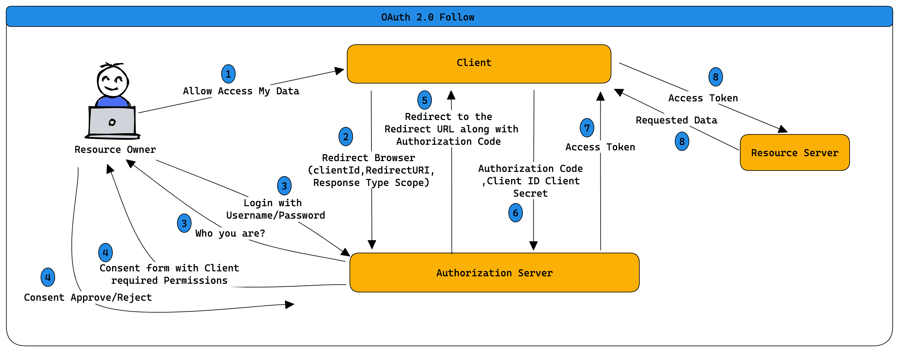

= OAuth2 and OpenID Connect Introduction
Motaz Mohammad <motazco135@gmail.com>
3.0, January 29, 2023: AsciiDoc article template
:toc:
:icons: font
:url-quickref: https://docs.asciidoctor.org/asciidoc/latest/syntax-quick-reference/

When you develop application you came to the point when you realize that you have  user specific information and need to  create user and  store this information and tight this information with that user.

To develop such thing you must :

* Store user credentials
* Manage login security (password requirement, captcha etc..)
* Create user registration process
* Develop a password rest process
* Develop 2-factor authentication

Once completed you will face another challenge related to do all of this activity into another application again.

OpenId connect and OAuth2 came to solve all of this pain point and save you a lot of time.

== OAuth 2.0
Is a security standard when you give one application permission to access your information in another application.

Instead of giving them your username & password you can give one application a key that gives them specific permission to access your data or do things on your-behalf in another application.

Steps to get permissions or consent are often refer to  **_Authorization_ **  or *__Delegated Authorization __*., You Authorize one application to access your data or use features in on other application on your-behalf without giving them your Username & Password.

Also, you can take back that key whenever you want.

=== OAuth 2.0 Terminology

.Resource Owner
----
That is you, you are the owner of your identity, your data and any action that can be performed with your account.
----

.Client
----
The Application thant want to access data or perform actions on behalf of the resource owner.
----

.Authorization Server
----
Is the application that knows the resource owner where the  resource owner having his account.
----

.Resource Server
----
The application programming interface or service that the clinet want to use on-behalf of the resource owner, some time the Authorization Server and Resource Server are same server, however there are cases where they are not the same or even in part in the same organization.
----

.Redirect URI
----
This is the URI that the  authorization server wuill redirect the resource owner back to after garnting permission to the clinet.
This some time are referd to CallBack URL
----

.Response Type
----
The type of information the Client is expected to recive, the most common response type is Authorization-Code
----

.Scope
----
This are the permissions that the Client want.
----

.Consent
----
The Authorization server gets the sopes the clinet is requesting and verifying this scops with the Resourece Owner wither or not wants to give the Client the pewrmission.
----

.Client-ID
----
Is Used to identefy the Client with the Authorization Server.
----

.Client Secret
----
This is the Secret password that only The Client and Authorization server konws, This is allow them to  share information sectrly behine the seens.
----

.Authorization Code
----
This is a showert Lived temprarily code that the Authorization server send bak to the client.
The Client send privatly the Auithorization Code along with the Client secret in extchange for an access token
----

.Access Token
----
Access token is the key that the Client will use from that point forward to comunicate with the resource server, This is like  key that gives the Client permessions to request data or perfoem action with the Resource Server on your-behalf.
The client dose not understand the token value, for him it is only set fo string values.
----

.OAuth 2.0 Follow

== OpenID Connect (OIDC)
OAuth 2.0 is designed only for Authorization for granting access for data or features from application to another,
OAuth is Like giving application (CLIENT) Key which is usefully for getting information and/or perform actions but the key dose not tell any information about you to the Client.

OpenId Connect(OIDC) is a layer on top of OAuth that add functionality around login and profile information about the person hwo is logged in .

Instead of a key OpenID Connect gives the Client application more information about you.

OpenID Connect enable the Client to establish a login session (Authentication) as well as gain information about the logged-in person.
When Authorization server support OpenID Connect it is called Identity provider as it provide information about the resource owner back to the client .

OpenId Connect enables scenario when one log-in can be used access subtitle applications (Single Sign On (SSO)).

OpenId Connect can't operate without the underline OAuth framework.

.OpenId Connect Follow
****
openID Connect follow looks the same as OAuth the only difference
is in step#2 where the Client sent redirect to the Browser the Scope type value will be "OPENID".

This informs the Authorization server this will be an OpenId Connect Exchanges.

Authorization server goes through all the same steps before and issues Authorization code back to the Client using the Resource Owner Browser.

The key difference when the client exchange the Authorization code with access token the Client receives *Access Token &  ID token*

ID Token is specifically formatted String of characters known as *JSON WEB Token (JWT)*, The Client can Extract information impeded in the JWT token such as ID,Name ,Expiration and can tell if JWT token has been tampered.

Data inside the JWT are called Claims,Client can request addition identity information from Authorization server using the access token.
****
https://motazco135.github.io/blog/[<-Back]