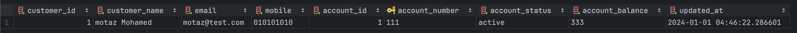

= Operational Data Store(ODS)
Motaz Mohammed Sameh <Motazco135@gmail.com>
3.0, July 29, 2022: AsciiDoc article template
:toc:
:icons: font
:url-quickref: https://docs.asciidoctor.org/asciidoc/latest/syntax-quick-reference/

In our previous https://www.linkedin.com/pulse/change-data-capture-debezium-motaz-mohammed-sameh-gqmif?trackingId=a2Ojn5KCRauNGwMi4617mA%3D%3D&lipi=urn%3Ali%3Apage%3Ad_flagship3_profile_view_base_recent_activity_content_view%3BIEQlFFJgQcWjju%2F7jGUngQ%3D%3D[Article] we see what is the Change Data Chapter (CDC) and what is the  need for it. +

In this article we will see how we can benefit from the Changer Data Capture (CDC) flow that we have build to build an Operational Data Store (ODS).

== What is Operational Data Store (ODS)

An operational data store (ODS) is a central database that provides a snapshot of the latest data from multiple transactional systems. +
It is used for operational reporting and as a source of data for the Enterprise Data warehouse. +
It enables organization to combine data in its original format from various sources into a single destination.

=== Characteristics of an Operational Data Store
. Real-Time or Near-Real-Time Data: +
ODS is designed to capture and integrate data from different operational systems in close to real-time. This allows organizations to have up-to-date information for reporting and analysis.
. Integration Hub: +
It acts as a central hub for integrating data from various sources and external data feeds.
. Simplified and Aggregated Data: +
ODS often involves data transformation and aggregation to present a simplified and unified view of the operational data. This can make it easier for reporting and analysis compared to raw data from source systems.

== How do operational data stores work?

.How ODS Work
image::resources/ods/ods-1.png[How ODS Work ]

An operational data store efficiently synthesizes and displays data to update you with the latest data. First, an operational data store collects data from many different sources. it collects the data from whatever sources you choose and makes it available for business intelligence functions.

Afterward, people across functions within your organization can view it for different business purposes. You can also leverage it to send timely notifications and emails to your integrated applications.

Operational data stores are for #real-time# data only. When an operational data store brings in new data, it erases the previously written data. If the source data changes or updates, the data store displays that new data.

== Use Case
As in our previous use case we built a Change Data Capture (CDC) flow and use it in monitoring customer transaction behaviour.
new we will build Operational Data Store (ODS) layer that will enable out mobile app to show a comprehensive dashboard view that provide customers with real time insights into their financial status and activities. +

This dashboard could include the following : +

. **Customer Profile information : **Basic details like name, contact information.
. *Account Overview:* Current balance, account type, and other relevant details for each account.
. **Recent Transactions: **A list of recent transactions for each account, including amounts, dates, and types (deposit, withdrawal).
. *Aggregated Financial Insights:* Summaries like total balance across all accounts, average monthly spending, recent large transactions, etc.

We will use Apache Flink to build our ODS Layer,
and we will write some source code  to provide our mobile app the required information to build the dashboard.

=== Set UP
We already finished the setup for most of our environment
please refer to  the Docker Compose file in the previous https://www.linkedin.com/pulse/change-data-capture-debezium-motaz-mohammed-sameh-gqmif%3FtrackingId=lhHqu3HlQbaJNayC%252FRH7Gg%253D%253D/?trackingId=lhHqu3HlQbaJNayC%2FRH7Gg%3D%3D[Article].

also we will need to set up Apache flink, please follow the steps in the following https://nightlies.apache.org/flink/flink-docs-stable/docs/try-flink/local_installation/[Link]

===  Let's Define the ODS Schema
Based on our use case we will do the following :
[NOTE]
We create a new schema for the ODS

* *Denormalize Customer-Account Table*
** Combines customer and account details for quick access.
** Fields: 'customer_id', 'customer_name', 'email','mobile','account_id', 'account_number','account_status' and 'account_balance'

[source,sql]
----
create table ods_schema.customer_account
(
    customer_id     integer not null,
    customer_name   varchar not null,
    email           varchar not null,
    mobile          varchar not null,
    account_id      integer not null,
    account_number  varchar not null
        constraint customer_account_pk
            primary key,
    account_status  varchar not null,
    account_balance varchar not null,
    updated_at timestamp default CURRENT_TIMESTAMP
);
----
* *Transaction Table*
** Stores individual transactions.
** Fields: 'transaction_id', 'transaction_ref_number','transaction_amount','transaction_type', 'account_number','transaction_date'.

[source,sql]
----
create table ods_schema.t_transaction
(
    transaction_id         serial    not null
        constraint t_transaction_pk
            primary key,
    transaction_ref_number varchar   not null,
    transaction_amount     varchar   not null,
    transaction_type       varchar   not null,
    account_number         varchar   not null,
    transaction_date       timestamp not null
);
----

* *Aggregated Financial Insights Table*
** Stores pre-calculated financial insights for quick access.
** Fields: customer_id, total_balance, average_monthly_spending

[source, sql]
----
create table ods_schema.t_financial_insights
(
    customer_id              integer not null
        constraint T_financial_insights_pk
            primary key,
    total_balance            varchar not null,
    average_monthly_spending varchar not null
);
----

=== Flink Job
Data Stream Programming prefers dealing with records as they arrived, however it comes with its complexity.   +
Flink is a distributed data stream programming engine, it includes facilities for managing and distributing data stream operations. +

Flink unite is known as job, the job in java is a deployable jar in the flink cluster . +

Our Flink job will need the following:

. Create Java Project and SetUp Maven dependency.
. Read from each Kafka topic.
. Deserialize the data from the Avro format.
. Transform the data to match our ODS schema.
. Write the transformed data to the PostgreSQL database.  +

---

* Create Java Project and SetUp Maven dependency

Flink provide Maven archetype to let you create Flink project for based on your flink version.

[source, shell]
----
mvn archetype:generate                               \
  -DarchetypeGroupId=org.apache.flink               \
  -DarchetypeArtifactId=flink-quickstart-java       \
  -DarchetypeVersion=<flink_version>                \
  -DgroupId=<your-group-id>                         \
  -DartifactId=<your-artifact-id>                   \
  -Dversion=<your-version>                          \
  -Dpackage=<your-package-name>                     \
  -DinteractiveMode=false
----

After the Project created you will found a sample flink jop created.

[NOTE]
We use Java 11 version +
To make the applications run within IDEA it is necessary to tick the Include dependencies with "Provided" scope.

Now include the following dependency in you pom file :

[surce,xml]
----
		<dependency>
			<groupId>org.apache.flink</groupId>
			<artifactId>flink-avro-confluent-registry</artifactId>
			<version>${flink.version}</version>
		</dependency>
		<dependency>
			<groupId>org.apache.flink</groupId>
			<artifactId>flink-connector-kafka</artifactId>
			<version>${flink.version}</version>
		</dependency>
----

* Read from each Kafka topic

Flink provide a kafka connector for reading data from and write data to kafka topics with exactly-once guarantees.

for more information about Kafka connector kindly check following Links:

. https://nightlies.apache.org/flink/flink-docs-release-1.18/docs/connectors/datastream/kafka/[ Apace Flink documentation]

. https://developer.confluent.io/courses/apache-flink/intro/[Confluent Apache Flink 101]

. https://developer.confluent.io/courses/flink-java/overview/[Building Apache Flink APPS in JAVA ].

Now our data are published in three topic each topic have his own https://avro.apache.org/[apache avro] SCHEMA. you can download the topic schema from the confluent Control center #"http://localhost:9021/clusters"#
copy the schema to your resource directory in the java project,
we will use Apache avro maven plugin to generate java classes from the avro schema add the following  to your pom.xml
[source,XML]
----
<!-- avro plugin  -->
<plugin>
    <groupId>org.apache.avro</groupId>
    <artifactId>avro-maven-plugin</artifactId>
    <version>1.11.1</version>
    <executions>
        <execution>
            <phase>generate-sources</phase>
            <goals>
                <goal>schema</goal>
            </goals>
            <configuration>
                <sourceDirectory>${project.basedir}/src/main/resources/avro/</sourceDirectory>
                <outputDirectory>${project.build.directory}/generated/avro</outputDirectory>
            </configuration>
        </execution>
    </executions>
</plugin>
----

Now create a new class with main method this will contain our flink job,

[source, java]
----
 // Set up Flink execution environment
StreamExecutionEnvironment env = StreamExecutionEnvironment.getExecutionEnvironment();
----

Setup properties that will have the connection to kafka properties

[source, java]
----
    private static Properties getProperties() {
        Properties props = new Properties();
        props.put(ConsumerConfig.BOOTSTRAP_SERVERS_CONFIG, BOOTSTRAP_SERVERS_CONFIG);
        return props;
    }
----

Create kafka source as below we will need to create Kafka source for each kafka topic as below  :

[source, JAVA]
----
KafkaSource<GenericRecord> accountKafkaSource = KafkaSource.<GenericRecord>builder()
                .setProperties(properties)
                .setTopics(KAFKA_TOPIC_ACCOUNT)
                .setGroupId("flink-consumer-ods-account-group")
                .setStartingOffsets(OffsetsInitializer.earliest())
                .setValueOnlyDeserializer(ConfluentRegistryAvroDeserializationSchema.forGeneric(fulfillment.transactions_schema.T_Accounts.Envelope.SCHEMA$, SCHEMA_REGISTRY_URL)).build();
----

Add the kafka source to the environment as following ,
and we will create a mapper function to convert the avro scham class to our POJO class
[source, JAVA]
----
        // Add sources to the environment
DataStream<CustomerDto> customerStream  = env.fromSource(customerKafkaSource, WatermarkStrategy.noWatermarks(), "Customer Source")
    .map(new MapFunction<GenericRecord, CustomerDto>() {
                    @Override
                    public CustomerDto map(GenericRecord genericRecord) throws Exception {
                        return mapToCustomerDto(genericRecord);
                    }
                });
----
Mapper function:

[source, java]
----
    private static CustomerDto mapToCustomerDto(GenericRecord genericRecord) {
        return Optional.ofNullable(genericRecord.get("after"))
                .map(afterRecord -> (GenericRecord) afterRecord)
                .map(after -> CustomerDto.builder()
                        .id(getIntValue(after, "id"))
                        .firstName(getStringValue(after, "first_name"))
                        .lastName(getStringValue(after, "last_name"))
                        .email(getStringValue(after, "email"))
                        .mobile(getStringValue(after, "mobile"))
                        .createdAt(convertToLocalDateTime(getLongValue(after, "created_at")))
                        .updatedAt(convertToLocalDateTime(getLongValue(after, "updated_at")))
                        .build())
                .orElse(null);
    }
    private static String getStringValue(GenericRecord record, String fieldName) {
        return Optional.ofNullable(record.get(fieldName))
                .map(Object::toString)
                .orElse(null);
    }

    private static Integer getIntValue(GenericRecord record, String fieldName) {
        return Optional.ofNullable(record.get(fieldName))
                .map(Object::toString)
                .map(Integer::valueOf)
                .orElse(null);
    }

    private static Long getLongValue(GenericRecord record, String fieldName) {
        return Optional.ofNullable(record.get(fieldName))
                .map(Object::toString)
                .map(Long::valueOf)
                .orElse(null);
    }

    private static LocalDateTime convertToLocalDateTime(long input){
        // convert to milliseconds
        long millisecondTimestamp = input / 1000;
        // Create an Instant
        Instant instant = Instant.ofEpochMilli(millisecondTimestamp);
        // add extra microseconds precision to the Instant
        long microseconds = input % 1000;
        instant = instant.plusNanos(microseconds * 1000);
        // Convert Instant to LocalDateTime via a ZonedDateTime
        return LocalDateTime.ofInstant(instant, ZoneId.systemDefault());
    }
----

Now let's execute our flink job and print the data stream, inorder to publish teh data to kafka topic we will run some update and insert statement on our database tables and our CDC will publish the data to kafka topic and our flink job will stream data from topic map it to POJO class and print it.
[source, java]
----
accountStream.print();
customerStream.print();
transactionStream.print();
// Execute the job
env.execute("Flink Multiple Kafka Sources");
----
FLink Log :
[source,shell]
----
CustomerDto(id=1, firstName=motaz, lastName=motaz, email=motaz@test.com, mobile=2322323232, createdAt=2023-12-12T22:58:05.758176, updatedAt=2023-12-12T22:58:05.758176)
----

Now we have 3 data streams that contains Customer , accounts and transaction data. +

We will start building the Denormalize Customer-Account data by the following steps  :

* *Define Output Data Structure:* +
We will create a class that will represent our denormalized data as the above table "customer_account"

[source, java]
----
@Builder
@ToString
@Setter
@Getter
@NoArgsConstructor
@AllArgsConstructor
public class CustomerAccountDto {

    private Integer customerId;
    private String customerName;
    private String email;
    private String mobile;
    private String accountId;
    private String accountStatus;
    private String accountBalance;
    private LocalDateTime updatedAt;

}
----

* *Create the Keyed Streams:* Since we have the customer id in both streams and the denormalized table is a combination of both streams we will use the "Customer ID" to join the two streams,
as this is how we'll associate accounts with their respective customers.

[source,java]
----
        DataStream<CustomerDto> customerStreamByKey = customerStream.keyBy(CustomerDto::getId);
        DataStream<AccountDto> accountStreamByKey = accountStream.keyBy(AccountDto::getCustomerId);
----
*  *Implement the Joining Logic:*
We will use Flink "CoProcessFunction" to join the latest customer and account information, as we receive the latest up-to-date data our state will maintain the latest, We are required to implement a mechanism for cleaning up state for customers or accounts that are no longer active or relevant, but it is not part of our POC .

[source,java]
----
public class CustomerAccountCoProcessFunction extends CoProcessFunction<CustomerDto, AccountDto, CustomerAccountDto> {

    // State to hold the latest CustomerDto and AccountDto for each customer ID
    private transient ValueState<CustomerDto> customerState;
    private transient ValueState<AccountDto> accountState;

    @Override
    public void open(Configuration parameters) {
        customerState = getRuntimeContext().getState(new ValueStateDescriptor<>("customerState", CustomerDto.class));
        accountState = getRuntimeContext().getState(new ValueStateDescriptor<>("accountState", AccountDto.class));
    }

    @Override
    public void processElement1(CustomerDto customer, CoProcessFunction<CustomerDto, AccountDto, CustomerAccountDto>.Context ctx, Collector<CustomerAccountDto> out) throws Exception {
        customerState.update(customer);
        // Attempt to join with the latest account
        AccountDto account = accountState.value();
        if (account != null) {
            out.collect(createDenormalized(customer, account));
        }
    }

    @Override
    public void processElement2(AccountDto account, CoProcessFunction<CustomerDto, AccountDto, CustomerAccountDto>.Context ctx, Collector<CustomerAccountDto> out) throws Exception {
        accountState.update(account);
        // Attempt to join with the latest customer
        CustomerDto customer = customerState.value();
        if (customer != null) {
            out.collect(createDenormalized(customer, account));
        }
    }

    private CustomerAccountDto createDenormalized(CustomerDto customer, AccountDto account) {
        CustomerAccountDto denormalized = new CustomerAccountDto();
        // Set fields from CustomerDto
        denormalized.setCustomerId(customer.getId());
        denormalized.setCustomerName(customer.getFirstName().concat(" ").concat(customer.getLastName()));
        denormalized.setEmail(customer.getEmail());
        denormalized.setMobile(customer.getMobile());

        // Set fields from AccountDto
        denormalized.setAccountId(account.getAccountNumber().toString());
        denormalized.setAccountStatus(account.getAccountStatus());
        denormalized.setAccountBalance(account.getAccountBalance());

        int diff = customer.getUpdatedAt().compareTo(account.getUpdatedAt());
        if(diff>0){
            denormalized.setUpdatedAt(customer.getUpdatedAt());
        }else if (diff < 0) {
            denormalized.setUpdatedAt(account.getUpdatedAt());
        }else{ //dates are equal
            denormalized.setUpdatedAt(account.getUpdatedAt());
        }
        return denormalized;
    }
}
----
* Connect the Streams and Apply the CoProcessFunction:

[source, java]
----
        DataStream<CustomerAccountDto> denormalizedStream = customerStreamByKey
                .connect(accountStreamByKey)
                .process(new CustomerAccountCoProcessFunction());

        // Now we can print or write the denormalized stream to a sink
        denormalizedStream.print();
----

* Create Sink to write the data to our ODS database:
This connector provides a sink that writes data to a JDBC database

** To use it, add the following dependency to your project (along with your JDBC driver): +
+
[source,xml]
----
<dependency>
    <groupId>org.apache.flink</groupId>
    <artifactId>flink-connector-jdbc</artifactId>
    <version>3.1.0-1.17</version>
</dependency>
<dependency>
    <groupId>org.postgresql</groupId>
    <artifactId>postgresql</artifactId>
    <version>42.7.1</version>
</dependency>
----
** Define the JDBC Sink: +
Define a JDBC sink that outlines how data from our stream is written to the PostgreSQL database. +
This involves specifying the SQL query for inserting/updating data, setting up the connection properties, and defining how each record in the stream is mapped to the query parameters.
+
[source,java]
----
    public static <T> SinkFunction<T> createJdbcSink(
            String sqlQuery,
            JdbcStatementBuilder<T> statementBuilder) {

        return JdbcSink.sink(
                sqlQuery,
                statementBuilder,
                JdbcExecutionOptions.builder()
                        .withBatchSize(1)
                        .build(),
                new JdbcConnectionOptions.JdbcConnectionOptionsBuilder()
                        .withUrl("jdbc:postgresql://localhost:5432/Transaction?currentSchema=ods_schema")
                        .withDriverName("org.postgresql.Driver")
                        .withUsername("postgres")
                        .withPassword("postgres")
                        .build());
    }
----

**  Implementing Sinks for customer_account Table:
[NOTE]
We implement Upsert(update if exists, insert if new) Logic in Database,For PostgresSQL we use 'ON CONFLICT'

+
[source,java]
----
// Define the SQL query for inserting data into the denormalized customer-account table
        String customerAccountSql = "Insert into customer_account (customer_id, customer_name, email, mobile, account_id, account_number, account_status, account_balance, updated_at) values (?,?,?,?,?,?,?,?,?) \n" +
                "ON CONFLICT (account_number) DO UPDATE " +
                "SET " +
                "    customer_name = EXCLUDED.customer_name,\n" +
                "    email = EXCLUDED.email,\n" +
                "    mobile = EXCLUDED.mobile,\n" +
                "    account_status = EXCLUDED.account_status,\n" +
                "    account_balance = EXCLUDED.account_balance";

        // Create the sink for the denormalized customer-account table
        SinkFunction<CustomerAccountDto> customerAccountSink = createJdbcSink(
                customerAccountSql,
                (statement, denormalizedCustomerAccount) -> {
                    // Set parameters from the denormalized customer account object
                    statement.setInt(1,denormalizedCustomerAccount.getCustomerId());
                    statement.setString(2,denormalizedCustomerAccount.getCustomerName());
                    statement.setString(3,denormalizedCustomerAccount.getEmail());
                    statement.setString(4,denormalizedCustomerAccount.getMobile());
                    statement.setInt(5, denormalizedCustomerAccount.getAccountId());
                    statement.setString(6,denormalizedCustomerAccount.getAccountNumber());
                    statement.setString(7,denormalizedCustomerAccount.getAccountStatus());
                    statement.setString(8,denormalizedCustomerAccount.getAccountBalance());
                    statement.setTimestamp(9, Timestamp.valueOf(denormalizedCustomerAccount.getUpdatedAt()));
                });
        denormalizedStream.addSink(customerAccountSink);
----

Now when we run the following sql query that simulate what happened when customer initiated a payment
transaction :

[source, sql]
----
insert into "t_transactions" (transaction_ref_number, customer_id, account_id,transaction_amount,transaction_type,created_at)
values ('ref-07', 1, 1,9,'Credit',current_timestamp);

update "T_Accounts"
set account_balance =333,updated_at = current_timestamp
where customer_id = 1;
----

The "denormalizedStream" will contain the following Data :
----
CustomerAccountDto(customerId=1, customerName=motaz Mohamed, email=motaz@test.com, mobile=010101010, accountId=1, accountNumber=111, accountStatus=active, accountBalance=333, updatedAt=2024-01-01T04:52:29.391427)
----

And the JDBC sink will write the data to the ODS schema "customer_account" table.

.Customer Account Table

We should do the same for transaction data in our ODS schema as following :

[source, java]
----
        // Define the SQL query for inserting data into the Transaction table
        String transactionSql = "Insert into t_transaction (transaction_id, transaction_ref_number, transaction_amount, transaction_type, account_number, transaction_date) " +
                " values (?,?,?,?,?,?) " ;
        // Create the sink for the Transaction table
        SinkFunction<TransactionDto> transactionSink = createJdbcSink(
                transactionSql,
                (statement, transactionDto) -> {
                    // Set parameters from the denormalized customer account object
                    statement.setInt(1,transactionDto.getId());
                    statement.setString(2,transactionDto.getTransactionRefNumber());
                    statement.setString(3,String.valueOf(transactionDto.getTransactionAmount()));
                    statement.setString(4,transactionDto.getTransactionType());
                    statement.setInt(5, transactionDto.getAccountId());
                    statement.setTimestamp(6,Timestamp.valueOf(transactionDto.getCreatedAt()));
                });
        transactionStream.addSink(transactionSink);
----

== Summary
We have understood the following : +

* What is Operational data Store and how it is work?
* We see how we can benefit from our CDC and Apache flink data stream to build our ODS layer.
* We see how we can consume Data From KAFKA using FLINK and create Data stream.
* We start our codding to build the ODS layer using Apache Flink for Our Use case, and we finalize the de-normalization of customer and account data alongside the transaction.
* We can build a sample API on top of the ODS layer to  build our Mobile Dashboard.

You can check the Code on th https://github.com/motazco135/flink-ods.git[GitHub]

What we will do next :

* Will Continue our development for the USE case to create the Financial Insights Data.
* Develop application on Top of ODS Layer to expose API.

https://motazco135.github.io/blog/[<-Back]