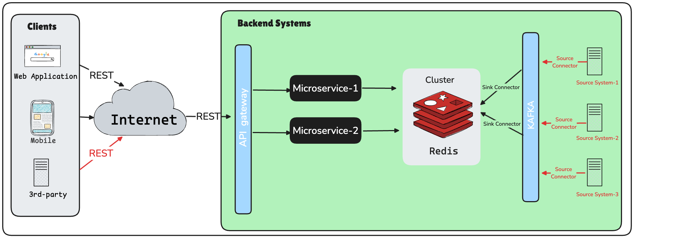
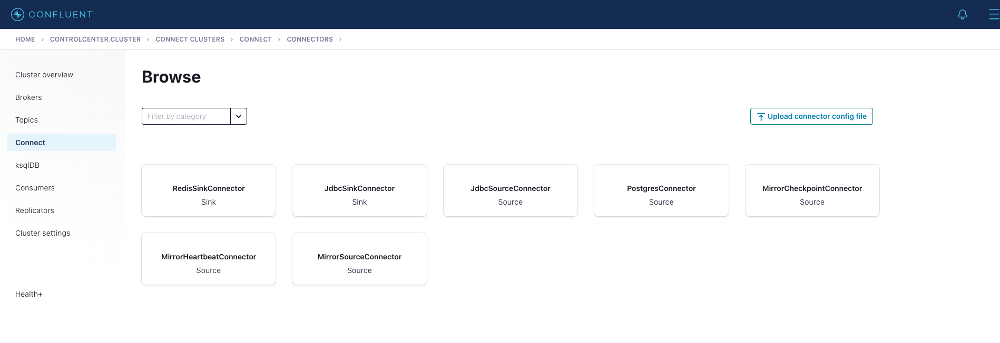
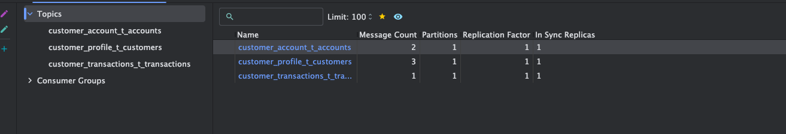
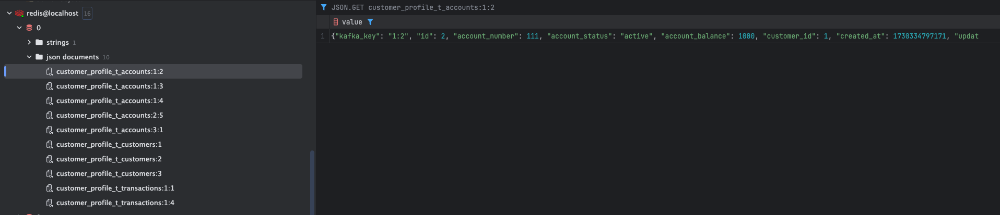
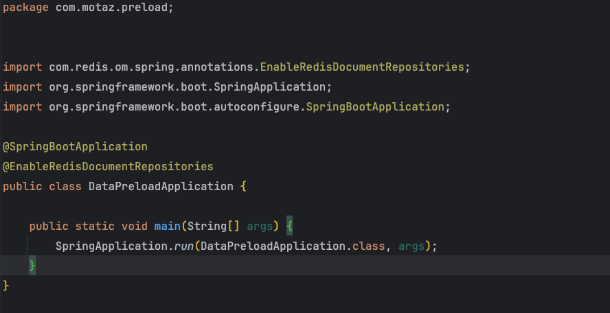
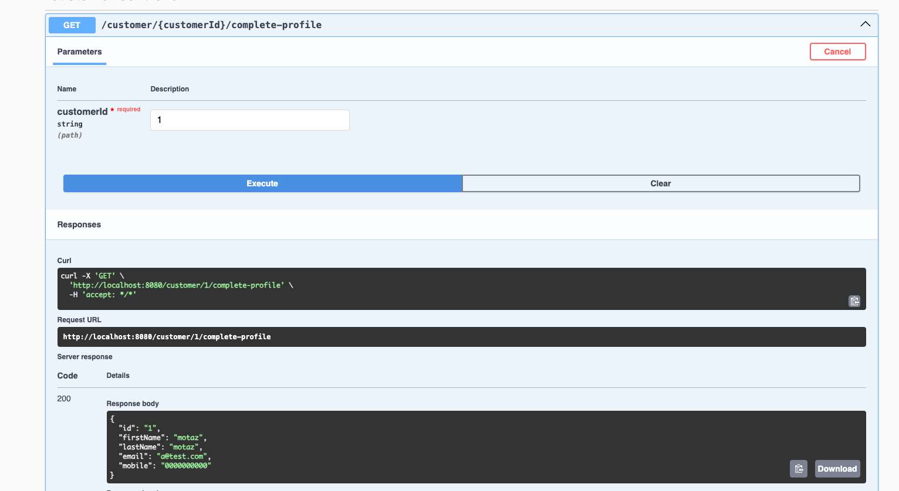

= Leveraging Redis for Preloading Data: Replacing ODS with In-Memory Performance
Motaz Mohammad <motazco135@gmail.com>
3.0, November 2, 2024: AsciiDoc article template
:toc:
:icons: font
:url-quickref: https://docs.asciidoctor.org/asciidoc/latest/syntax-quick-reference/

In our previous article on https://www.linkedin.com/pulse/change-data-capture-debezium-motaz-mohammed-sameh-gqmif%3FtrackingId=lhHqu3HlQbaJNayC%252FRH7Gg%253D%253D/?trackingId=lhHqu3HlQbaJNayC%2FRH7Gg%3D%3D[Change Data Capture (CDC) with Debezium], we demonstrated how to set up CDC using Debezium and Kafka. We used a log-based Kafka connector to replicate data from the database into Kafka topics.

Subsequently, we explored building an https://www.linkedin.com/pulse/operational-data-storeods-motaz-mohammed-sameh-csfrf/?trackingId=7im4G5EjQrCw6c8E3vlrpQ%3D%3D[Operational Data Store (ODS)] by leveraging Apache Flink to stream data from Kafka and write it to an ODS database, providing a centralized, real-time data store for various applications to consume fresh data.

This article explores how *Redis* can be used to preload essential data, offering an in-memory, high-performance alternative to ODS for certain use cases.

== Introduction
Preloading data refers to the process of loading essential, frequently accessed data into a fast, in-memory store like(Apache Ignite or Rides) before the user requests it. This ensures that when the user logs in, the application can quickly fetch and serve this data without hitting slower, external database or APIs.

By using PreLoading data we benefit of the following :

. *Improved User Experience*: Immediate data availability reduces loading times, enhancing responsiveness.
. *Reduced Load on Backend Systems:* By retrieving preloaded data from Redis, fewer real-time calls are made to the core system.
. *Real-Time Updates:* Using CDC, the data remains fresh and up-to-date.

== Why Redis?
. Fast Data Access
.. 	Redis is an in-memory data store, making it significantly faster for read and write operations compared to traditional databases. This speed is essential for real-time applications where fast access to frequently used data (e.g., customer profile, account balances, transaction history) improves user experience.

. Reduce Main Load onm the Main Database and source systems
..	By using Redis as a caching layer or primary store for frequently accessed data, we reduce the load on the main database and source systems. This setup ensures the database doesn’t become a bottleneck when numerous users or applications access it simultaneously, especially during peak times.
..	Redis stores copies of data from the database, allowing the main database to handle fewer queries and reducing the need for frequent, potentially costly queries to the backend.

. Compatability with Kafka for real time data sync
.. Redis can work well with Kafka connectors to keep cached data in sync with source databases. In this POC, we will see the Redis Sink Connector set up to pull data from Kafka topics and populate Redis in real-time.

. Persistence Option for Cashed Data
.. Redis can persist data to disk, which makes it ideal not only as a caching layer but also as a durable data store. In this POC, we can configure Redis persistence options to back up in-memory data on disk periodically. This feature helps maintain data availability even if Redis restarts, which is critical for maintaining a consistent state without rebuilding the cache entirely.

== Dose It Replace Operational Data Store ?
Redis can effectively replace the ODS (Operational Data Store) layer for specific use cases, particularly for real-time, frequently accessed data.

Here’s why Redis serves as a suitable ODS replacement:

. High Performance and Low Latency
. Real-Time Data Synchronization with Kafka
. Data Durability with Persistence Options
. Aggregation and Simplification of Data Access

For example, instead of loading all customer and transaction data into an ODS, we can preload recent customer transactions and balance data into Redis.
For detailed historical transactions or analytical queries, we can still rely on ODS.

ODS is still beneficial for complex queries, historical data, and larger datasets that don’t fit well in memory.

Preloading can be a faster alternative for time-sensitive and high-frequency data but is not a complete replacement for ODS in all use cases.

Hybrid ODS approach is my recommendation where Redis can still serve as a fast access layer for the most frequently accessed data, while less commonly accessed data remains in a secondary ODS or database, reducing Redis’s memory load.The critical part is defining which data to store in Redis versus the ODS

In summary:

* Preloading using Redis solves performance issues for real-time data access.
* ODS is better for handling larger, less time-sensitive datasets and complex analytics.

== Implementation Overview

In this approach, we utilize preloading concepts with *Redis*, which serves as both an in-memory store for fast access and a persistent storage solution.

By leveraging Redis integration with Kafka, we stream real-time data changes captured by JDBC source connector directly into Redis. This effectively replaces the need for an ODS layer, allowing us to store frequently accessed data in memory for performance while ensuring data durability and long-term storage with Redis persistence features.

Our Architecture Approach :

* Use Case :
+
We have customer profile and customer account information along with available balance at each account and customer account transaction history.
+
All this information are available at source systems however each one is available in a separated API, so to get all of this information we need to call 3 APIs.
+
We will implement preloading concept to make data available at redis which will provide easy and fast access, also we will build a small microservice that  will aggregate all data in one single response.

* Implementation Steps :

. Step 1: Install and configure Redis
. Step 2: Set Up Kafka JDBC Source Connector to Push Data into Kafka
. Step 3: Set Up Kafka Redis Sink Connector to Stream data from Kafka to Redis
. Step 4: Developing Sample Microservice to aggregate data in response.

=== Step 1: Install and configure Redis
* To install Redis we will update our docker compose file to include https://redis.io/docs/latest/operate/oss_and_stack/install/install-stack/docker/[Redis-Stack] as following :
+
[source,yaml]
----
name: kafka-postgres-redis
version: '3'
services:
  broker:
    image: confluentinc/cp-kafka:7.4.0
    hostname: broker
    container_name: broker
    ports:
      - "9092:9092"
      - "9101:9101"
    environment:
      KAFKA_NODE_ID: 1
      KAFKA_LISTENER_SECURITY_PROTOCOL_MAP: 'CONTROLLER:PLAINTEXT,PLAINTEXT:PLAINTEXT,PLAINTEXT_HOST:PLAINTEXT'
      KAFKA_ADVERTISED_LISTENERS: 'PLAINTEXT://broker:29092,PLAINTEXT_HOST://localhost:9092'
      KAFKA_OFFSETS_TOPIC_REPLICATION_FACTOR: 1
      KAFKA_GROUP_INITIAL_REBALANCE_DELAY_MS: 0
      KAFKA_TRANSACTION_STATE_LOG_MIN_ISR: 1
      KAFKA_TRANSACTION_STATE_LOG_REPLICATION_FACTOR: 1
      KAFKA_JMX_PORT: 9101
      KAFKA_JMX_HOSTNAME: localhost
      KAFKA_PROCESS_ROLES: 'broker,controller'
      KAFKA_CONTROLLER_QUORUM_VOTERS: '1@broker:29093'
      KAFKA_LISTENERS: 'PLAINTEXT://broker:29092,CONTROLLER://broker:29093,PLAINTEXT_HOST://0.0.0.0:9092'
      KAFKA_INTER_BROKER_LISTENER_NAME: 'PLAINTEXT'
      KAFKA_CONTROLLER_LISTENER_NAMES: 'CONTROLLER'
      KAFKA_LOG_DIRS: '/tmp/kraft-combined-logs'
      # Replace CLUSTER_ID with a unique base64 UUID using "bin/kafka-storage.sh random-uuid"
      # See https://docs.confluent.io/kafka/operations-tools/kafka-tools.html#kafka-storage-sh
      CLUSTER_ID: 'MkU3OEVBNTcwNTJENDM2Qk'

  schema-registry:
    image: confluentinc/cp-schema-registry:7.4.0
    hostname: schema-registry
    container_name: schema-registry
    depends_on:
      - broker
    ports:
      - "8081:8081"
    environment:
      SCHEMA_REGISTRY_HOST_NAME: schema-registry
      SCHEMA_REGISTRY_KAFKASTORE_BOOTSTRAP_SERVERS: 'broker:29092'
      SCHEMA_REGISTRY_LISTENERS: http://0.0.0.0:8081

  kafka-connect:
    image: confluentinc/cp-kafka-connect-base:latest
    container_name: kafka-connect
    depends_on:
      - broker
      - schema-registry
      - db
    ports:
      - "8083:8083"
    links:
      - "db:database"
    environment:
      CONNECT_BOOTSTRAP_SERVERS: "broker:29092"
      CONNECT_REST_PORT: 8083
      CONNECT_GROUP_ID: kafka-connect
      CONNECT_CONFIG_STORAGE_TOPIC: _connect-configs
      CONNECT_OFFSET_STORAGE_TOPIC: _connect-offsets
      CONNECT_STATUS_STORAGE_TOPIC: _connect-status
      CONNECT_KEY_CONVERTER: org.apache.kafka.connect.storage.StringConverter
      CONNECT_VALUE_CONVERTER: io.confluent.connect.avro.AvroConverter
      CONNECT_VALUE_CONVERTER_SCHEMA_REGISTRY_URL: 'http://schema-registry:8081'
      CONNECT_REST_ADVERTISED_HOST_NAME: "kafka-connect"
      CONNECT_LOG4J_APPENDER_STDOUT_LAYOUT_CONVERSIONPATTERN: "[%d] %p %X{connector.context}%m (%c:%L)%n"
      CONNECT_CONFIG_STORAGE_REPLICATION_FACTOR: "1"
      CONNECT_OFFSET_STORAGE_REPLICATION_FACTOR: "1"
      CONNECT_STATUS_STORAGE_REPLICATION_FACTOR: "1"
    #  ---------------
      CONNECT_PLUGIN_PATH: /usr/share/java,/usr/share/confluent-hub-components,/data/connect-jars
    # If you want to use the Confluent Hub installer to d/l component, but make them available
    # when running this offline, spin up the stack once and then run :
    #   docker cp kafka-connect:/usr/share/confluent-hub-components ./data/connect-jars
    volumes:
      - $PWD/data:/data
    # In the command section, $ are replaced with $$ to avoid the error 'Invalid interpolation format for "command" option'
    command:
      - bash
      - -c
      - |
        echo "Installing Connector"
        confluent-hub install --no-prompt confluentinc/kafka-connect-jdbc:latest
        confluent-hub install --no-prompt debezium/debezium-connector-postgresql:latest
        confluent-hub install --no-prompt apacheignite/kafka-ignite-sink:latest
        confluent-hub install --no-prompt jcustenborder/kafka-connect-redis:latest
        #
        echo "Launching Kafka Connect worker"
        /etc/confluent/docker/run &
        #
        sleep infinity

  control-center:
    image: confluentinc/cp-enterprise-control-center:7.4.0
    hostname: control-center
    container_name: control-center
    depends_on:
      - broker
      - schema-registry
      - kafka-connect
    ports:
      - "9021:9021"
    environment:
      CONTROL_CENTER_CONNECT_HEALTHCHECK_ENDPOINT: '/connectors'
      CONTROL_CENTER_BOOTSTRAP_SERVERS: 'broker:29092'
      CONTROL_CENTER_CONNECT_CONNECT_CLUSTER: 'kafka-connect:8083'
      CONTROL_CENTER_SCHEMA_REGISTRY_URL: "http://schema-registry:8081"
      CONTROL_CENTER_REPLICATION_FACTOR: 1
      CONTROL_CENTER_INTERNAL_TOPICS_PARTITIONS: 1
      CONTROL_CENTER_MONITORING_INTERCEPTOR_TOPIC_PARTITIONS: 1
      CONFLUENT_METRICS_TOPIC_REPLICATION: 1
      PORT: 9021
    command:
      - bash
      - -c
      - |
        echo "Waiting two minutes for Kafka brokers to start and
               necessary topics to be available"
        sleep 120
        /etc/confluent/docker/run

  rest-proxy:
    image: confluentinc/cp-kafka-rest:7.4.0
    depends_on:
      - broker
      - schema-registry
    ports:
      - "8082:8082"
    hostname: rest-proxy
    container_name: rest-proxy
    environment:
      KAFKA_REST_HOST_NAME: rest-proxy
      KAFKA_REST_BOOTSTRAP_SERVERS: 'broker:29092'
      KAFKA_REST_LISTENERS: "http://0.0.0.0:8082"
      KAFKA_REST_SCHEMA_REGISTRY_URL: 'http://schema-registry:8081'

  db:
    image: postgres
    container_name: postgres-db
    hostname: db
    ports:
      - "5432:5432"
    environment:
      POSTGRES_PASSWORD: postgres

  redis:
    image: redis/redis-stack-server:latest
    container_name: redis
    hostname: redis
    ports:
      - "6379:6379"
    command: [
      "redis-server",
      "--requirepass admin",
      "--appendonly", "yes",       # Enable AOF persistence
      "--save", "60", "10000",     # Save every 1 min if 10,000 keys changed
      "--save", "300", "10",       # Save every 5 mins if 10 keys changed
      "--save", "900", "1",         # Save every 15 mins if 1 key changed
      "--loadmodule",  "/opt/redis-stack/lib/redisearch.so" , #load redisearch
      "--loadmodule","/opt/redis-stack/lib/rejson.so"         #load json.set
    ]

  redisinsight:
    image: redis/redisinsight:latest
    depends_on:
      - redis
    container_name: redisinsight
    hostname: redisinsight
    ports:
      - "5540:5540"
----
+
We add Redis in the compose file, also we add the following configuration :
+
. Append-Only file (AOF):
+
.. *--appendonly yes*:
+
This enables the AOF (Append-Only File) persistence mechanism. With AOF, Redis logs every write operation (like SET, INCR) to a file. This approach ensures that each data update is recorded, allowing for high durability in case of failure.
+
. RDB Snapshots:
+
.. --save 60 1000 :
+
This configuration specifies that Redis should take a snapshot (RDB file) every 60 seconds if 10,000 keys have changed since the last snapshot. RDB (Redis Database) snapshots capture the entire dataset and save it to disk periodically.
+
.. --save 300 10: This configuration creates a snapshot every 5 minutes if at least 10 keys have changed.
+
.. --save 900 1: This configuration saves the dataset every 15 minutes if at least 1 key has changed.
+
RDB is faster for restart recovery but can miss some very recent changes compared to AOF because it only saves at configured intervals. Redis will choose the most recent snapshot file and then, if AOF is enabled, apply any remaining AOF commands to ensure data accuracy.RDB is faster for restart recovery but can miss some very recent changes compared to AOF because it only saves at configured intervals. Redis will choose the most recent snapshot file and then, if AOF is enabled, apply any remaining AOF commands to ensure data accuracy.

=== Step 2: Set Up Kafka JDBC Source Connector to Push Data into Kafka

Now we have our database , kafka and redis up and running in Docker ,
we will start the  next step where we need to pull new added records or updated data in realtime to Kafka , we will achieve this by using KAFKA JDBC source connector, however before we jump into kafka let's first create Database tables

* Database Tables Script:
+
[source, sql]
----
create table t_customers
(
    id         serial
        constraint "T_Customers_pk"
            primary key,
    first_name varchar                             not null,
    last_name  varchar                             not null,
    email      varchar                             not null,
    mobile     varchar                             not null,
    created_at timestamp default CURRENT_TIMESTAMP not null,
    updated_at timestamp default CURRENT_TIMESTAMP not null
);
create table t_accounts
(
    id              serial
        constraint "T_Accounts_pk"
            primary key,
    account_number  integer                             not null,
    account_status  varchar                             not null,
    account_balance integer                             not null,
    customer_id     integer                             not null
        constraint t_accounts_t_customers_id_fk
            references t_customers,
    created_at      timestamp default CURRENT_TIMESTAMP not null,
    updated_at      timestamp default CURRENT_TIMESTAMP not null
);

create table t_transactions
(
    id                     serial
        constraint t_transactions_pk
            primary key,
    transaction_ref_number varchar                             not null,
    customer_id            integer                             not null
        constraint "T_Transactions_T_Customers_id_fk"
            references t_customers,
    account_id             integer                             not null
        constraint "T_Transactions_T_Accounts_id_fk"
            references t_accounts,
    transaction_amount     integer                             not null,
    transaction_type       varchar                             not null,
    created_at             timestamp default CURRENT_TIMESTAMP not null,
    updated_at             timestamp default CURRENT_TIMESTAMP not null
);
----

We will use Kafka https://docs.confluent.io/kafka-connectors/jdbc/current/index.html[JDBC connector], to be able to use the source connector we will need to install the JDBC connector inside the connector container by using the following command :
[source, shell]
----
confluent-hub install confluentinc/kafka-connect-jdbc:latest --no-prompt
----
This command downloads and installs the kafka JDBC connector into the Kafka Connect plugins directory.
After installation completed we should restart the container and the connector will appear as following :

.JDBC Source Connector for Confluent Platform

This connector will capture any database changes and publish the changes to kafka topic.
we will create a separate source connector for each table:

. Customers Source Connector:
+
[source, json]
----
{
  "name": "JdbcSourceConnectorConnector_Customers",
  "config": {
    "transforms.ExtractKeyField.type": "org.apache.kafka.connect.transforms.ExtractField$Key",
    "transforms.ExtractKeyField.field": "id",
    "transforms.CastIdToString.spec": "id:string",
    "transforms.CastIdToString.type": "org.apache.kafka.connect.transforms.Cast$Value",
    "name": "JdbcSourceConnectorConnector_Customers",
    "connector.class": "io.confluent.connect.jdbc.JdbcSourceConnector",
    "transforms": "CastIdToString, SetKey, ExtractKeyField",
    "transforms.SetKey.type": "org.apache.kafka.connect.transforms.ValueToKey",
    "transforms.SetKey.fields": "id",
    "connection.url": "jdbc:postgresql://db:5432/postgres",
    "connection.user": "postgres",
    "connection.password": "********",
    "table.whitelist": "",
    "mode": "timestamp+incrementing",
    "incrementing.column.name": "id",
    "timestamp.column.name": "updated_at",
    "query": "SELECT id,first_name,last_name,email,mobile,created_at, updated_at FROM t_customers",
    "topic.prefix": "customer_profile_t_customers"
  }
}
----
+
We create the connector and make sure that each kafka message will have a key , we will use these key later in Redis Sink Connector to Store JSON document with that key and will be used later in the query at the microservice.

. Accounts Source Connector
+
[source, json]
----
{
  "name": "JdbcSourceConnectorConnector_Accounts",
  "config": {
    "transforms.ExtractKey.type": "org.apache.kafka.connect.transforms.ExtractField$Key",
    "transforms.ExtractKey.field": "id",
    "transforms.setKEy.fields": "id",
    "transforms.setKEy.type": "org.apache.kafka.connect.transforms.ValueToKey",
    "name": "JdbcSourceConnectorConnector_Accounts",
    "connector.class": "io.confluent.connect.jdbc.JdbcSourceConnector",
    "transforms": "CastIdToString, setKEy, ExtractKey",
    "transforms.CastIdToString.type": "org.apache.kafka.connect.transforms.Cast$Value",
    "transforms.CastIdToString.spec": "id:string",
    "connection.url": "jdbc:postgresql://db:5432/postgres",
    "connection.user": "postgres",
    "connection.password": "********",
    "table.whitelist": "",
    "mode": "timestamp+incrementing",
    "incrementing.column.name": "id",
    "timestamp.column.name": "updated_at",
    "query": "SELECT   id,CAST(customer_id AS VARCHAR) AS customer_id,CAST(account_number AS VARCHAR) AS account_number,account_status, CAST(account_balance AS VARCHAR) AS account_balance, created_at, updated_at FROM  t_accounts",
    "topic.prefix": "customer_profile_t_accounts"
  }
}
----
+
. Transactions Source Connector
+
[source, json]
----
{
  "name": "JdbcSourceConnectorConnector_Transactions",
  "config": {
    "name": "JdbcSourceConnectorConnector_Transactions",
    "connector.class": "io.confluent.connect.jdbc.JdbcSourceConnector",
    "transforms": "CastIdToSttring, SetKey, ExtractKey",
    "transforms.CastIdToSttring.type": "org.apache.kafka.connect.transforms.Cast$Value",
    "transforms.CastIdToSttring.spec": "id:string",
    "transforms.SetKey.type": "org.apache.kafka.connect.transforms.ValueToKey",
    "transforms.SetKey.fields": "id",
    "transforms.ExtractKey.type": "org.apache.kafka.connect.transforms.ExtractField$Key",
    "transforms.ExtractKey.field": "id",
    "connection.url": "jdbc:postgresql://db:5432/postgres",
    "connection.user": "postgres",
    "connection.password": "********",
    "table.whitelist": "",
    "mode": "timestamp+incrementing",
    "incrementing.column.name": "id",
    "timestamp.column.name": "updated_at",
    "query": "SELECT    id,     transaction_ref_number,     CAST(customer_id AS VARCHAR) AS customer_id,     CAST(account_id AS VARCHAR) AS account_id,     CAST(transaction_amount AS VARCHAR) AS transaction_amount,     transaction_type,     created_at,     updated_at FROM     t_transactions",
    "topic.prefix": "customer_profile_t_transactions"
  }
}
----

Now lets insert records to Our table to and check kafka topic dose it contains the messages or not:

* Insert data to tables:
+
[source,sql]
----
INSERT INTO public.T_Customers (id, first_name, last_name, email, mobile, created_at, updated_at)
VALUES (DEFAULT, 'motaz'::varchar, 'motaz'::varchar, 'a@test.com'::varchar, '0000000000'::varchar, DEFAULT, DEFAULT);

INSERT INTO public.T_Customers (id, first_name, last_name, email, mobile, created_at, updated_at)
VALUES (DEFAULT, 'motaz'::varchar, 'motaz'::varchar, 'motaz@test.com'::varchar, '01234566678'::varchar, DEFAULT, DEFAULT);

INSERT INTO public.T_Accounts (id, account_number, account_status, account_balance, customer_id, created_at, updated_at)
VALUES (DEFAULT, 111::integer, 'active'::varchar, 1000::integer, 1::integer, DEFAULT, DEFAULT);

INSERT INTO public.T_Accounts (id, account_number, account_status, account_balance, customer_id, created_at, updated_at)
VALUES (DEFAULT, 222::integer, 'active'::varchar, 1000::integer, 2::integer, DEFAULT, DEFAULT);

INSERT INTO public.T_Transactions (id, transaction_ref_number, customer_id, account_id, transaction_amount,
                                   transaction_type, created_at, updated_at)
VALUES (DEFAULT, 'ref-01'::varchar, 1::integer, 1::integer, 10::integer, 'Credit'::varchar, DEFAULT,Default);

----

.Messages are available at kafka topics

=== Step 3: Set Up Kafka Redis Sink Connector to Stream data from Kafka to Redis

Now that data is flowing into kafka, next step is to sink the data between kafka and redis we have the following options :

* Create a kafka consumer to pull data from kafka topics and write it to Redis.
* Use Kafka Sink connector to sink the data from kafka topics to Redis.

We will use https://www.confluent.io/hub/redis/redis-kafka-connect[Kafka Redis sink connector], to be able to use the sink connector we will need to install Redis sink connector inside the *connector container* by using the following command :
[source, shell]
----
confluent-hub install redis/redis-kafka-connect:latest --no-prompt
----
This command downloads and installs the Redis Sink Connector into the Kafka Connect plugins directory.
After installation completed we should restart the container and the connector will appear as following :

.Redis Sink Connector for Confluent Platform

Now we will configure Redis Sink Connector for each kafka topic:

. Customers Sink Connector
+
[source,json]
----
{
  "name": "RedisSinkConnectorConnector_customers",
  "config": {
    "value.converter.schema.registry.url": "http://schema-registry:8081",
    "name": "RedisSinkConnectorConnector_customers",
    "connector.class": "com.redis.kafka.connect.RedisSinkConnector",
    "key.converter": "org.apache.kafka.connect.storage.StringConverter",
    "value.converter": "io.confluent.connect.avro.AvroConverter",
    "topics": "customer_profile_t_customers",
    "redis.cluster": "false",
    "redis.host": "redis",
    "redis.password": "*****",
    "redis.command": "JSONSET"
  }
}
----
+
As You see we use String key converter and avro value converter to be able to consume data from the required topic and insert a JSON document in redis

. Accounts Sink Connector
+
[source,json]
----
{
  "name": "RedisSinkConnectorConnector_transactions",
  "config": {
    "value.converter.schema.registry.url": "http://schema-registry:8081",
    "name": "RedisSinkConnectorConnector_transactions",
    "connector.class": "com.redis.kafka.connect.RedisSinkConnector",
    "key.converter": "org.apache.kafka.connect.storage.StringConverter",
    "value.converter": "io.confluent.connect.avro.AvroConverter",
    "topics": "customer_profile_t_transactions",
    "redis.cluster": "false",
    "redis.host": "redis",
    "redis.password": "*****",
    "redis.command": "JSONSET"
  }
}
----
. Transactions Sink Connector
+
[source,json]
----
{
  "name": "RedisSinkConnectorConnector_transactions",
  "config": {
    "name": "RedisSinkConnectorConnector_transactions",
    "connector.class": "com.redis.kafka.connect.RedisSinkConnector",
    "key.converter": "org.apache.kafka.connect.storage.StringConverter",
    "value.converter": "org.apache.kafka.connect.storage.StringConverter",
    "topics": "customer_transactions_t_transactions",
    "redis.cluster": "false",
    "redis.host": "redis",
    "redis.command": "SET",
    "redis.key": " "
  }
}
----
+

If we check Redis Database it will contain  :
+
.Redis Database

+
Now we have the following Json Document as following :

* Customer Documents :
** Key Format : <topic_name:customer_id>
** Example :  customer_profile_t_customers:1

* Account Documents :
** Key Format : <topic_name:account_id>
** Example :  customer_profile_t_accounts:2
* Customer Topic Documents :
** Key Format : <topic_name:transaction_id>
** Example :  customer_profile_t_transactions:2

=== Step 4: Developing Sample Microservice to aggregate data in response
Now we will start Developing our sample microservice , we will use Spring Boot framework and https://redis.io/learn/develop/java/spring/redis-om/redis-om-spring[Redis OM -Spring], The aim of the Redis OM family of projects is to provide high-level abstractions idiomatically implemented for your language/platform of choice.

* We'll Start by creating SpringBoot application using the https://start.spring.io/[Spring initializer], we will use the following maven dependency.

[source,xml]
----
    <dependencies>
        <dependency>
            <groupId>com.redis.om</groupId>
            <artifactId>redis-om-spring</artifactId>
            <version>0.9.7</version>
        </dependency>
        <dependency>
            <groupId>org.springframework.boot</groupId>
            <artifactId>spring-boot-starter-web</artifactId>
        </dependency>

        <dependency>
            <groupId>org.projectlombok</groupId>
            <artifactId>lombok</artifactId>
            <optional>true</optional>
        </dependency>
        <dependency>
            <groupId>org.springframework.boot</groupId>
            <artifactId>spring-boot-starter-test</artifactId>
            <scope>test</scope>
        </dependency>
        <dependency>
            <groupId>org.springdoc</groupId>
            <artifactId>springdoc-openapi-starter-webmvc-ui</artifactId>
            <version>2.6.0</version>
        </dependency>
    </dependencies>
----
* Enabling Redis Document Repositories
+
To enable the Redis Document Repositories we add the #@EnableRedisDocumentRepositories# which will allow us to use the RedisDocumentRepository class as the type of our Data Repositories.
+
.Main Class

* Domain Entity
We'll have Three Classes in out microservice, the Customer class , Account Class and Transaction Class,
To mark the class as JSON document we use the #@Document# annotation
+
[source, java]
----
@Data
@RequiredArgsConstructor(staticName = "of")
@AllArgsConstructor(access = AccessLevel.PROTECTED)
@Document(value="customer_profile_t_customers",indexName = "CustomerIdx")
public class Customer {

    @Id
    @Indexed
    private String id;

    @Indexed
    @SerializedName("first_name")
    private String firstName;

    @Indexed
    @SerializedName("last_name")
    private String lastName;

    private String email;
    private String mobile;

}
----
+

Redis OM-Spring provide capitulates on tob of the Spring Data Redis plus :

. @Indexed:
   .. Marks a field as indexed, making it possible to search by that field.This is typically used for basic text search fields, but not support partial or wildcard matches
. @Searchable:
	.. Specifically designed for full-text search capabilities.Allows for searching text fields with partial matches, wildcard searches.
. @TagIndexed:
    .. Used for fields where you need to filter on specific values or categories.Supports exact and wildcard matches.
+
We will create the same to the tow remaining  JSON document (Account&Transaction)

* Repository Class
+
[source,java]
----
@Repository
public interface CustomerRepository extends RedisDocumentRepository<Customer,String> {

}
----
Use Repository class to access the Redis document and be able to run requires.

* Controller :
+
[source,java]
----
@RestController
@RequestMapping("/customer")
@RequiredArgsConstructor
public class CustomerController {

    private final CustomerService customerService;

    @GetMapping("/{customerId}/complete-profile")
    public ResponseEntity<Customer> getCustomerProfile(@PathVariable String customerId) {
        Optional<Customer> profile = customerService.getCustomerProfile(customerId);
        if(profile.isPresent()) {
           return ResponseEntity.ok(profile.get());
        }
        return ResponseEntity.notFound().build();
    }
}
----

* Run Request
Call the customer service by customer id =1
+
.Customer Profile

+

Now we can create aggregated Customer profile to get customer and his related accounts and list of top 5 transaction on each account .
+
[source, java]
----
    public Optional<CompleteProfileResponse> getCustomerCompleteProfile(String customerId){
        Optional<Customer> optionalCustomer = customerRepository.findById(customerId);
        if(optionalCustomer.isEmpty()){
            return Optional.empty();
        }
        Iterable<Account> accounts = accountRepository.findByCustomerId(customerId);
        List<AccountResponse> accountResponseList = new ArrayList<>();
        accounts.forEach(account -> {
            List<Transaction> recentTransactions = transactionRepository.findTop10ByAccountIdOrderByCreatedAtDesc(account.getId());
            accountResponseList.add(new AccountResponse(account,recentTransactions) );
        });

        AccountResponse accountResponse = new AccountResponse();
        return Optional.of(new CompleteProfileResponse(optionalCustomer.get(), accountResponseList));
    }
----
+
[source,json]
----
{
  "customer": {
    "id": "1",
    "firstName": "motaz",
    "lastName": "motaz",
    "email": "a@test.com",
    "mobile": "0000000000"
  },
  "accounts": [
    {
      "account": {
        "id": "2",
        "accountNumber": "111",
        "accountStatus": "active",
        "accountBalance": "1000",
        "customerId": "1"
      },
      "transactions": []
    },
    {
      "account": {
        "id": "4",
        "accountNumber": "333",
        "accountStatus": "active",
        "accountBalance": "100",
        "customerId": "1"
      },
      "transactions": [
        {
          "id": "4",
          "transactionRefNumber": "ref-02",
          "customerId": "1",
          "accountId": "4",
          "transactionAmount": "10",
          "transactionType": "Credit",
          "createdAt": 1730509389682,
          "updatedAt": 1730509389682
        },
        {
          "id": "2",
          "transactionRefNumber": "ref-02",
          "customerId": "1",
          "accountId": "4",
          "transactionAmount": "10",
          "transactionType": "Credit",
          "createdAt": 1730335188316,
          "updatedAt": 1730433794472
        }
      ]
    }
  ]
}
----

== Summary
In this article, we explored an optimized approach for preloading data using Redis and Kafka connectors, particularly for real-time applications that need fast, efficient data access. We demonstrated how Redis can serve as an effective alternative to traditional ODS layers, reducing database load and providing enhanced data retrieval speed.

We also introduced an aggregation service that consolidates customer data, account summaries, and recent transactions into a single API, enhancing the user experience.

Full implementation details are available in the GitHub repository for further customization. https://github.com/motazco135/data-preload/[GitHub].

